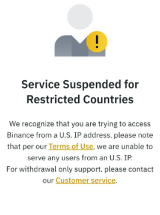
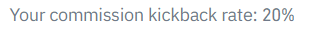
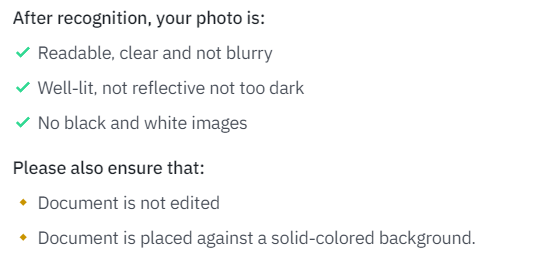

前置
- 非中国内地、美国ip的[[usage]]代理
  - 美国不行：

内容
- [注册网址](https://accounts.binance.com/en/register)
- 截至2022.7，中国内地法律不允许加密货币交易所，所以随便选个居住地（如香港）
  - 但这个其实目前有点灰色，之后就又可以用内地手机和身份证了
- create personal account
- 填邮箱，密码，推荐人ID（以减少佣金费率）
  - 
- 邮箱收邮件，验证邮箱
- 手机收验证码，验证手机（可以使用内地手机）
- 身份认证（可以用内地真实信息，真实身份证）
  - 对身份证拍摄清晰准确度有要求！
    - 
  - 自拍（用手机或电脑前置摄像头）
  - 人脸识别认证
- 然后提示让你等待
  - 
  - 等待时不能使用
  - 等待完成后邮箱有发邮件