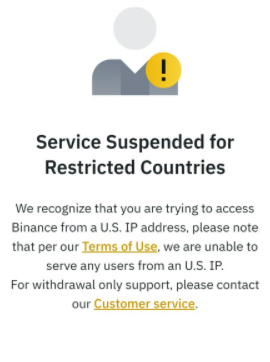
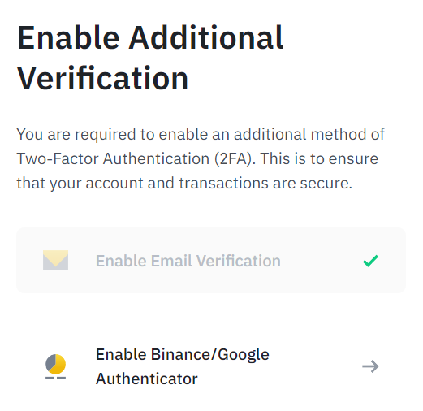
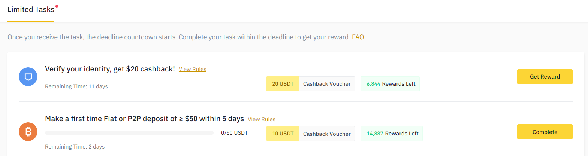

[toc]
## 前置
- [[general-principles/account]]
- 非中国内地、美国ip的[[proxy-basics]]代理或[[vpn]]
  - 美国不行：
- 通过[非小号](https://www.feixiaohao.co/)、[币萌](https://bimeng.org/)等获取基础信息，作大致了解
  - [[telegram]]搜索tokenmore有一些人和频道，可能有进一步信息
- 可选：[[nobepay]]注册虚拟visa卡，使得可以smoothly充钱
## 注册
- [注册binance的网址](https://accounts.binance.com/en/register?ref=IW76A547)
  - 这里已经自动加入了推荐ID，有费率优惠
- 截至2022.7，中国内地法律不允许加密货币交易所，所以随便选个居住地（如香港）
  - 但这个其实目前有点灰色
  - 之后的各个步骤就又可以用内地手机和身份证了
- 选择create personal account
- 填邮箱，密码，推荐ID（以减少佣金费率）
  - 一个可选的推荐ID：`IW76A547`
- 邮箱收邮件，验证邮箱（建议主流国外邮箱如[[outlook]], [[google]]）
- 手机收验证码，验证手机（可以使用内地手机）
## 认证
### 身份认证
- 用内地真实信息，真实身份证
  - 对身份证拍摄清晰准确度有要求！
    - 
  - 自拍（用手机或电脑前置摄像头）
  - 人脸识别认证
- 然后提示让你等待
  - 
  - 等待时不能使用
  - 等待完成后邮箱有发邮件
  - 其声称的Estimated completion date可能比实际的晚很多
  - 认证完成后，邮箱收到邮件
    - 且送你一个盲盒(mystery box)
### 2FA
- 这时登录提示你完成了第一步verification，但还需要two-factor authentication
  - 
  - 这里以Google Authenticator为例，网页版点上图第二个按钮，并结合手机操作，完成所需步骤（当然需要代理）
  - 最后一步的三个六位验证码，一个手机短信，一个邮箱，还有一个就是authenticator app上实时显示的口令
## 新手奖励
- 哈哈，保持身心健康哈，差不多得了（手动滑稽）
- 