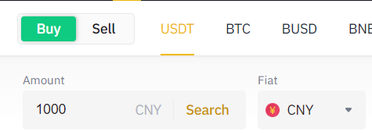
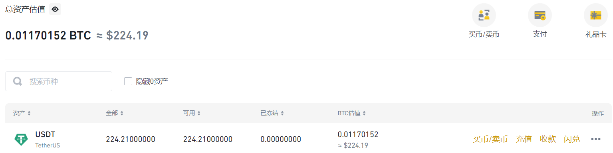

## 前置
- [[binance]]
## fiat / P2P充值
- fiat法币指人民币，美元等
  - 把法币充值成加密货币
  - 一种是交易所官方渠道，一种是民间点对点（这个就小心被骗哈）
- 例如P2P
  - 选择CNY，筛选额度（你充的少当然别人提供的优惠少）
  - 别想着什么外币，除非你真有香港卡哈哈哈，它们要什么SWIFT, FPS等，内地卡肯定不行
  - 可以筛选支付宝/微信等
- 完成后效果
## crypto充值
## 充值之后
- 刚进来在“资金账户”（Funding）
- 可以中英对照一下这些账户
- 典型功能：转入理财账户。需要[先转到现货账户](https://www.binance.com/zh-CN/support/faq/b10712050ff945089aea7160f5e8f6b6/)
- 2000USDT以下活期10%哦