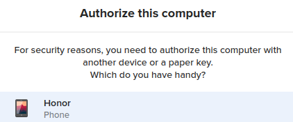
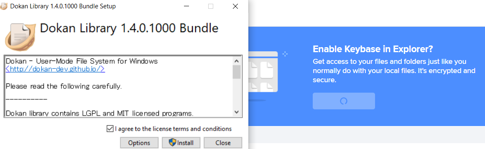
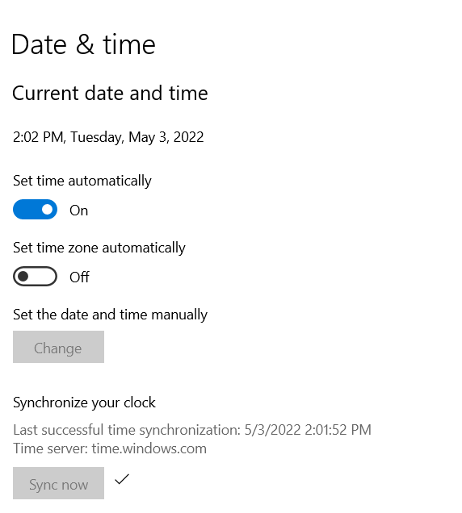

https://keybase.io/
相比[[telegram]]好处：时至2022.4还不用翻墙
相比微信好处
- 加密，不会监测和删除你的东西
- 多平台可同步记录，也能同步删除
  - 无限期无痕迹撤回
  - 有痕迹修改
- 能发大文件，不压缩图（作为手机电脑的文件传输助手，非常方便）
- 能发比微信长得多的文本不截断
- 有一些基本markdown格式可以用
# 安装和创建账号
- 安装是傻瓜式。官网写得很清楚
- 创建账号非常的模块化，这就非常爽，不像很多国产软件必须手机号，也不像[[teamviewer]]之类的屑软件必须要手机啥的
  - 加密码：则可退出和下次登录
  - 加手机或邮箱：则别人可通过这些找到你
- 然而每个设备必须有一个代号。这方便之后加新设备
# 多设备（跨平台）
- 可以多设备传递文件、文字信息、图片等
典型验证界面：比如你先在手机登录（或注册），命名你的手机为`Honor`，然后电脑登录时就选择用它验证，根据提示操作即可（比如扫码）

- 文件管理：左侧Files选项卡
  - 
  - 可以打开同步功能，就会在这个设备上同步
  - todo：还没成功（文件太大？）
# troubleshooting
- 如果你电脑时间不对，需要联网同步时间，确保安全性。比如win10的
# 操作
- 删除记录：有延迟，但你按过了删除的一定会被删掉（存疑todo）
# teams
- 相比微信群好处
  - 拉进来直接看到所有历史
  - 一个team有许多channel（通知、灌水etc）
- 有时候teams发不出东西但私发可以，原因未知（可能是网不好？）
  - 私发可能确实对网络负担小