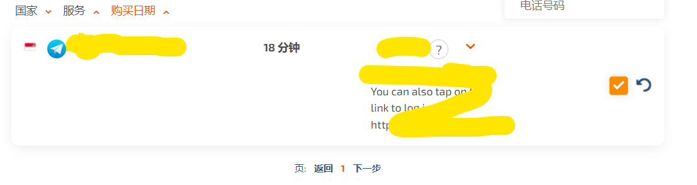

- 用途
  - 不想用自己的手机注册网站？
  - [[telegram]]，google账号等用中国手机功能受限或注册不了？
  - 用别人（海外）的手机号注册即可！
- 举例
  - https://sms-activate.org/cn
  - 当然有很多这种接码网站
  - 用邮箱注册上述网站，在邮箱中找邮件，验证
  - 充值一些卢布：可以支付宝付。几块钱而已
    - 支付宝上不了了？注意[[proxy/usage]]，代理别忘了及时关掉！
  - 选择软件类型（比如[[telegram]]），选择国家
    - 手机telegram客户端中让他发验证码，然后网页上等着接
  
    - 接到了码，输入到手机上，ok，成功注册
    - 注册其它网站时，当然也可能是电脑端发出请求，sms网页上等着接。只不过telegram要求手机注册而已