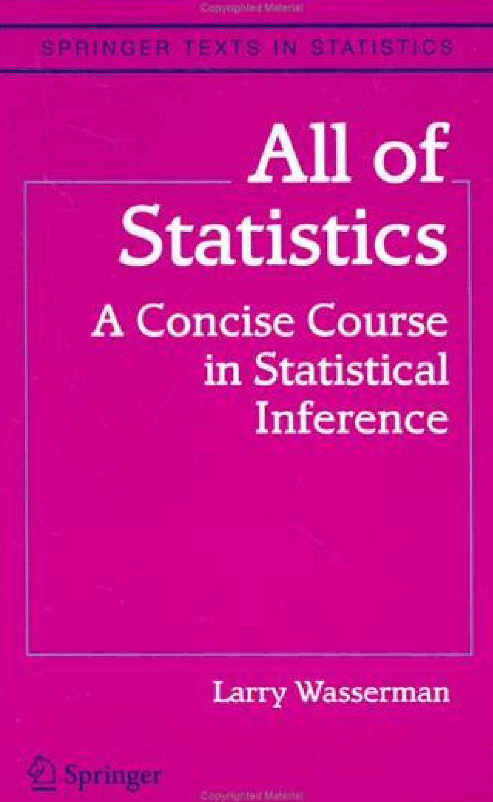

- 基本信息
  - 
  - ISBN: 978-0-387-21736-9
- 非官方题解总结等[[github]]链接
  - https://github.com/telmo-correa/all-of-statistics
- Preface
    > Statistics, data mining, and machine learning are all concerned with collecting and analyzing data. For some time, statistics research was conducted in statistics departments while data mining and machine learning research was conducted in computer science departments. Statisticians thought that computer scientists were reinventing the wheel. Computer scientists thought that statistical theory didn’t apply to their problems.
    - 这一段附近统计和机器学习（CS）关系很值得关注
    - 特点
      - 速成，内容多（“大全”）
      - 可以给计算机、机器学习的人搞
      - 不是完全严谨。有些证明省略
  - 正逆过程
    - 正：概率，由机制生成数据，如[[introduction]]
    - 逆：`Data analysis, machine learning and data mining are various names given to the practice of statistical inference, depending on the context.`
    - 所以本书也可以作为比较快速的概率入门
- Statistics/Data Mining Dictionary对照表有点绝