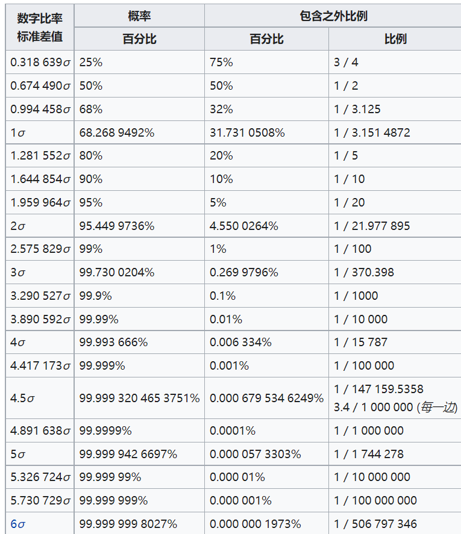

https://zh.wikipedia.org/zh-cn/%E6%AD%A3%E6%80%81%E5%88%86%E5%B8%83
- 双侧正态分布表
  - 正负一个标准差内是$68.x\%$
  - 注意 #单双侧 问题

背诵矩
- 中心矩
  - 可以用[[calculus/gamma]]函数得结果
  - 也可以用[[characteristic-function]]的导数对应各阶矩
  - 奇数0
  - 偶数$\sigma^2, 3\sigma^4,5*3\sigma^6\cdots$
- 原点矩$V_1=\mu, V_2=\mu^2+\sigma^2, V_3 = \mu^3 + 3\mu \sigma^2,V_4=\mu^4 + 6\mu^2\sigma^2+3\sigma^4$
    - 原点矩表达式这里可以看出二项式系数（14641）（最后一项是二项式系数1乘以中心矩$3\sigma^4$）
    - 换句话说：背诵了中心矩表达式，可以快速推出原点矩