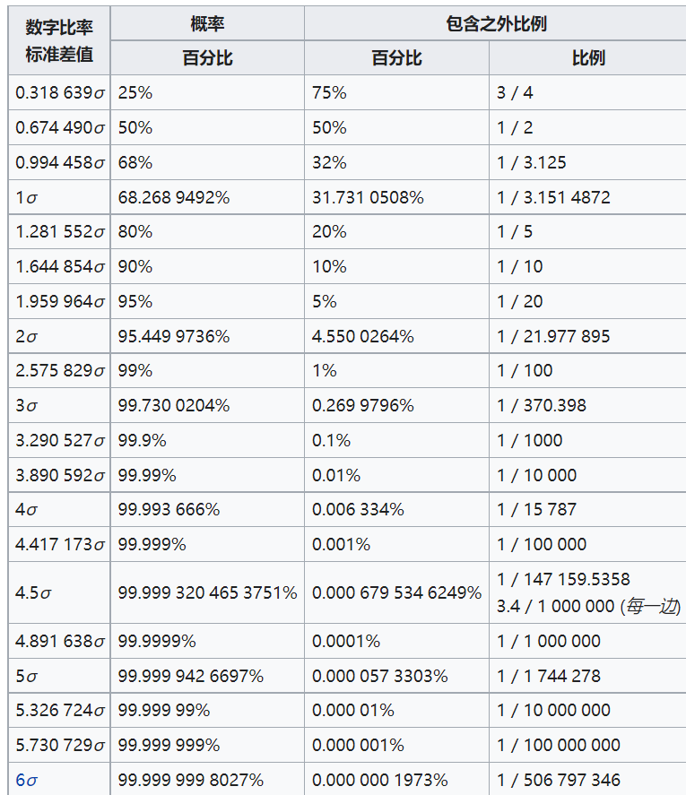

- 很多时候，人为做正规化等，构造出满足……的统计量，再查[[character/quantile]]表来做[[2-estimation]]，[[hypothesis-testing]]
- [[2-estimation]]例子：[[normal]]，[[t-distribution]]，[[chi-square]]等（后两者是两“族”，对于每个自然数有一个分布）
  - 区间估计时很好用
- [[hypothesis-testing]]中也有大量构造统计量，查表使用分位数（联系[[水平和功效]]中的水平）的例子
# [[normal]]
- 双侧正态分布表：这里“之外”都是双侧之外
  - 
- 正负一个标准差内是$68.3\%$
- 正负约两个（1.96）标准差内是$95\%$，[[p-value]], [[hypothesis-testing]]常用
- 正负三个标准差内是$99.7\%$，千分之三概率出去，实际中认为覆盖绝大部分数据