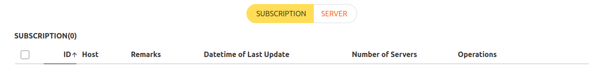
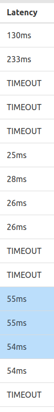

# 基础知识
- 翻墙需要客户端（比如[[v2raya]]），也需要节点（也有些集成了节点比如`geph`）
  - 客户端和节点配齐了就得到了露出来的端口
  - 例如[[v2raya]]默认的20171，`qv2ray`默认的8889
  - 之后可以结合[[configure]]使得能成功翻墙
- 节点种类不同，适配的协议、客户端和插件可能不同
  - 常见种类有`vmess`，`ssr`等。从分享链接开头可以看出
# 导入节点
- 节点分享可以是文字链接，有时也可导出成二维码
  - 导入时：[[v2raya]]等软件可以导入文字或二维码
  - [[windows-client]]中，qv2ray无法扫描二维码。这种就要解码成文字再添加
  - [[android]]扫码当然最方便
  - [[toolbox/web]]小工具转换二维码和文字
- 可导入的链接一般有两种
  - 一种是SERVER，一种是SUBSCRIPTION
    - 后者即别人打包好的定期更新的SERVER集合
  - 导入位置可能不同，使用方法也可能不同
    - [[v2raya]]如图
    - [qv2ray官网教程](https://qv2ray.net/lang/zh/getting-started/step3.html#%E8%AE%A2%E9%98%85)
  - 第一次导入SUBSCRIPTION之后需要Update，这里需要联网
    - 这里有可能必须翻墙才能上，这就形成了死锁……那就只能[[temp-solution]]一下，比如借师兄的节点
    - 有时会出现的情况：订阅链接本身也是变化的（被铁拳等），也就是套娃，你需要记住稳定网址（访问它往往需要翻墙），才能时刻知道（无需翻墙）可用的订阅网址。得到了可用的订阅网址，才能进一步得到节点
    - SUBSCRIPTION是得到SERVER集合，所以之后的用法和SERVER并没有本质区别
    - 如果发现很多SERVER都被干烂了就更新Update一下，说不定就发现又给了很多好的
# 应对铁拳
- 节点可能被铁拳干烂（如果你看了太多反动网站。或者节点太公交车）
  - 干烂的表现：要不然ping直接不通，要不然ping通但是没法通过它上谷歌
    - 所以说ping只能做一遍筛选
  - 一些客户端可以`ping`节点看看当前是否被干烂，性能如何等等
    - 例如[[v2raya]]的
  - 订阅也可能被干烂，可能导致Update总是不成功等
- 节点不是同时选用越多越好
  - 虽然可能稳定，且能防止个别挂等（“分布式”）
  - 但是如果一个不安全那也全都不安全
  - 甚至可能因为一个不安全导致浏览器认为不安全，不允许你访问
  - 甚至铁拳可能放毒，就是表面上ping得通，但是用不了，然后你的batch里只要有它就整个用不了
  - 所以为了排查节点问题，可以
    - 更新订阅
    - 测试ping
    - 找到其中的一个比较快的节点，**只**打开它试试
    - 还不行就多换几个试试，每次只开一个节点
    - 如果这样还是有问题，那就大概率不是节点问题
# 买节点的option
- https://qmxqmx.com/index.php/90/ 有简介，链接等
- https://okz2.com/#/dashboard 可以微信支付宝购买（有一天试用）
  - 可能绑定[[telegram]]获得更多功能
  - 侧边栏有文档
  - 2022-8更新：被锤爆了，现在新的可以用的[网址](http://okztwo.com/#/login)
- 最傻瓜：[geph](https://geph.io/zhs)
  - 有免费版也有付费版。自带节点可以选
  - 注：2022.12新版geph有[[vpn]]