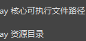
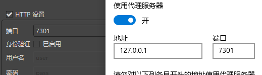
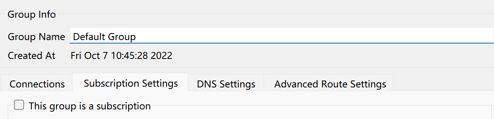

# qv2ray
## 下载
首先使用[[temp-solution]]（比如借学长的代理，比如洋葱，比如[[hosts]]碰运气，全力下载到以下两个release安装包）（当然直接找学长要安装包也是一种[[temp-solution]]）
https://github.com/v2ray/v2ray-core/releases
- 注：时至2022.4，Latest的v4.31.0只有源码没有现成包。应该找早些的版本。找到win64（现在一般都是64位）下载

https://github.com/Qv2ray/Qv2ray/releases
## 配置
- 解压`v2ray`内核
- 解压`qv2ray`，打开程序
- Preferences - Kernel Settings处指定`v2ray`内核位置（有两个地方要设置）
- Inbound Settings处根据是否要灵活切换端口，去掉/勾选Set System Proxy（这是在帮你[[configure-proxy]]，会导致你自己没法灵活换）
  - 如果去掉，那么该界面右边`HTTP Settings - Port`要对的上你系统里的代理设置（开始菜单搜索proxy）
- 选做：如果除了`v2ray`还需要`ssr`协议，那么
  - https://github.com/Qv2ray/QvPlugin-SSR/releases/
  - 找到你操作系统对应的`.dll`下载
  - 放到`qv2ray`安装目录下的插件目录（`某某\plugins`）
  - 重启`qv2ray`
- 最后只需要参考[[node]]，配置节点即可使用
  - [qv2ray配置节点官网教程](https://qv2ray.net/lang/zh/getting-started/step3.html)
  - 如果是订阅，需要在`groups`处设置，在此图处打勾
    - 
    - 解码方式：如果一种不行就试另一种
- 其它troubleshooting
  - Inbound Settings - SOCKS Settings - 默认的1089可能被占，你随便换个端口即可
    - 注意这个并不是[[configure-proxy]]所说的“暴露的端口”
# clash
- 大同小异，[下载链接](https://github.com/Fndroid/clash_for_windows_pkg/releases)-
- 注意需要使用7-zip
- `Profile`处可以添加[[node]]订阅