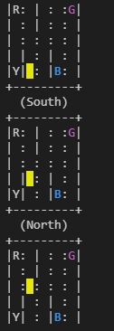

- 前置
  - （可选，推荐）[[conda-installation]]
  - [[pip]]
  - [[pytorch/basics/installation]]或tensorflow
  - 了解[[gym/env]]
# 基础
- [文档](https://docs.ray.io/en/releases-1.13.0/ray-overview/index.html)
  - 注意适用版本`1.13.0`，并不是`2.x`
  - 官网的第一个示例[参考](https://docs.ray.io/en/releases-1.13.0/rllib/index.html)
- 安装（我们是用于rl，所以安装`"ray[rllib]"`）
    - `conda create -y -n rllib python=3.7`
    - `conda activate rllib`
    - `pip install "ray[rllib]" tensorflow torch`
      - 当然也可只装一部分，如
      - `pip install "ray[rllib]" torch`
    - `pip install "gym[atari]" "gym[accept-rom-license]" atari_py`
      - 这是用于运行atari示例
    - `pip install pygame`
      - 这个是官网文档漏了
# 示例
- 第一个示例（来自[这里](https://docs.ray.io/en/releases-1.13.0/rllib/index.html)）
  - `trainer.train()`会返回各种关键信息
  - `trainer.evaluate()`会调用`render`，展现出字符串画
```python
# Import the RL algorithm (Trainer) we would like to use.
from ray.rllib.agents.ppo import PPOTrainer

# Configure the algorithm.
config = {
    # Environment (RLlib understands openAI gym registered strings).
    "env": "Taxi-v3",
    # Use 2 environment workers (aka "rollout workers") that parallelly
    # collect samples from their own environment clone(s).
    "num_workers": 2,
    # **Modified the script copied from the doc to use torch.**
    "framework": "torch",
    # Tweak the default model provided automatically by RLlib,
    # given the environment's observation- and action spaces.
    "model": {
        "fcnet_hiddens": [64, 64],
        "fcnet_activation": "relu",
    },
    # Set up a separate evaluation worker set for the
    # `trainer.evaluate()` call after training (see below).
    "evaluation_num_workers": 1,
    # Only for evaluation runs, render the env.
    "evaluation_config": {
        "render_env": True,
    },
}

# Create our RLlib Trainer.
trainer = PPOTrainer(config=config)

# Run it for n training iterations. A training iteration includes
# parallel sample collection by the environment workers as well as
# loss calculation on the collected batch and a model update.
for _ in range(3):
    print(trainer.train())

# Evaluate the trained Trainer (and render each timestep to the shell's
# output).
trainer.evaluate()
```

- 其它agent
  - 参考[[conda/commands]]，[[module-launch]]，[[where-from]]等，去安装路径
  - 例如`~/anaconda3/envs/rllib/lib/python3.7/site-packages/ray/rllib/`
  - 再根据刚刚的`from ray.rllib.agents.ppo import PPOTrainer`一句，找到`rllib/agents`，从而可看到各种agents
  - 当然，也可以上官网[文档](https://docs.ray.io/en/releases-1.13.0/rllib/rllib-algorithms.html)看有哪些可用，以及它们是否可用于离散/连续环境，是否可用于`torch/tf`等
  - 举例：`SAC`，如下
```python
from ray.rllib.agents.sac import SACTrainer
config = {
    "env": "Taxi-v3",
    "num_workers": 2,
    "framework": "torch",
    "model": {
        "fcnet_hiddens": [64, 64],
        "fcnet_activation": "relu",
    },
    "evaluation_num_workers": 1,
    "evaluation_config": {
        "render_env": True,
    },
}
trainer = SACTrainer(config=config)
for _ in range(3):
    print(trainer.train())
trainer.evaluate()
```