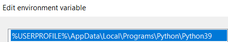

- 前置[[conda]]
## Windows
- [官网](https://www.anaconda.com/download)下载
- 安装
  - 过程中可能涉及[[windows/env-var#path]]的加入。是否要改就根据你的想法和需要
  - 如果想要在[[powershell-basics]]中使用`conda`命令，则必须
    - 要么[[windows/env-var#安装时自动设置path]]
    - 要么[[windows/env-var#持久设置]]手动设置`path`
      - [参考资料](https://blog.csdn.net/Python_Smily/article/details/105993200)
        - 但这个不完全正确，毕竟[[read-doc#二手资料]]
      - 实际上还是在`Anaconda Powershell Prompt`中输出`$env:path`进行比较，才得到准确list
        - `<path\to>\Anaconda3`
        - `<path\to>\Anaconda3\Library\mingw-w64\bin`
        - `<path\to>\Anaconda3\Library\usr\bin`
        - `<path\to>\Anaconda3\Library\bin`
        - `<path\to>\Anaconda3\Scripts`
        - `<path\to>\Anaconda3\bin`
        - `<path\to>\Anaconda3\condabin`
      - 再手动`conda init powershell`类似[[conda-installation#Linux]]
- 开始菜单搜索`Anaconda Prompt`，里面就可以用[[conda/commands]]
  - 当然为了方便，可以把快捷方式发送到桌面
  - 这个`Prompt`能用conda的[[conda/commands]]和`cd`、`python`等命令，但不能`ls`等，所以说和linux终端还是不同
  - 当然这个Prompt和[[powershell-basics]]也不同
    - 具体地：如果你没加[[windows/env-var]]之类的，那么[[powershell-basics]]就没法`conda`
    - 但powershell可以`ls`
  - 如果又想`ls`（或者其它[[powershell-basics]]命令）怎么办
    - 有个`Anaconda Powershell Prompt`可以兼得
    - 如果你设置了[[windows/env-var#path]]那直接[[powershell-basics]]就可以兼得
- 注：即使安装了conda，在[[powershell-basics]]也可能无法直接使用`python`命令
  - 如果你想在windows做出和linux类似的**不用conda时是‘默认裸’python，用conda时可选环境**的效果，需要自行[下载安装](https://www.python.org/downloads/windows/)并加一条到`path`这个[[windows/env-var]]
  - 且必须放到靠前的位置，参考[[dont-trust-others]]对微软爹味的控诉
  - 
## Linux
- [官网](https://www.anaconda.com/)下载（可能浏览器下也可能找到对应链接后`wget`下载）
  - 总之得到某个`.sh`
- 运行该`.sh`脚本，参考[[11-basic-scripting-partA]]
  - 即给`777`权限后直接`./某某.sh`，或者`bash 某某.sh`
- 过程中根据提示操作。其中如果`init`处选了`y`，那么你`cat ~/.bashrc`结尾就能看到添加的一些语句
  - 哦，你用的[[zsh]]就去看`cat ~/.zshrc`
  - 如果你要两者都用，之后需要`conda init <SHELL>`，参考[[conda-in-docker]]中的操作
- `conda --version`检查安装结果
- [[silent]]安装：类似于：
```sh
wget https://repo.anaconda.com/archive/Anaconda3-2022.10-Linux-x86_64.sh
bash ./Ana*.sh
rm ./Ana*.sh
. ~/anaconda3/bin/activate
conda init bash
```
## miniconda
- 搜索miniconda，找安装所需要下载的`.sh`地址
  - 例如： https://mirrors.tuna.tsinghua.edu.cn/anaconda/miniconda/Miniconda3-4.7.12.1-Linux-x86_64.sh
- [[compatibility]]比anaconda好，大小也比较小节省[[resource-management/disk]]