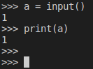

- 终端输入`python`命令（或[[conda-in-docker]]的Anaconda Prompt之类的地方输入），出现`>>>`，即可在此交互操作
- 特性
  - 一次输入一条语句。例如你接连输入
    - `for i in range(1):`
    - <code>&nbsp; print(i)</code>
    - `print(1)`
    - 就不行
    - 必须在`print(i)`后那里直接回车，“空一行”，等执行完`for`循环语句再输入下一句`print(1)`
  - 可以直接粘贴不含空行的函数`def`
  - 有些特性类似于[[11-basic-scripting-partA]]
    - 具体地，比如是否末尾是否有`; \`造成的区别
    - 比如交互式python中粘贴以下内容
    - 复制时，请包含第四行全空的行
    - 这是没有`; \`的示例
```python
a = input()
1
print(a)

```
就会输出`1`

在[[meta-programming]]中就有提到这个特性