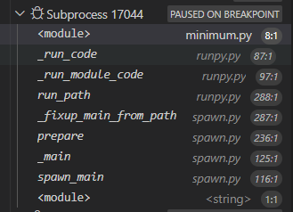

- 参考
  - [文档](https://docs.python.org/zh-cn/3.9/library/multiprocessing.html)
  - 进程相比“线程”，能充分利用多核
    - [[py-process-thread]]
    - [知乎](https://zhuanlan.zhihu.com/p/455171966)
    - [知乎](https://zhuanlan.zhihu.com/p/103135242)
  - [[resource-management/commands]] 查看逻辑[[cpu]]个数，大致作为`Pool`进程个数参考
## 最小唯象例子（利用`Pool`并行）
- [参考](minimum.py)
  - 这就说明可以简单做并行
  - 典型输出
```text
[0, 1, 4, 9, 16, 25, 36, 49, 64, 81]
1.602008581161499
[0, 1, 4, 9, 16, 25, 36, 49, 64, 81]
0.5942842960357666
[0, 1, 4, 9, 16, 25, 36, 49, 64, 81]
2.041583776473999
```
- 注
  - 参考[[availability]]，由于不能pickle太复杂的东西，所以
    - 这里的`f`
      - 不能用`lambda`定义
      - 不能定义在局部
  - `if __name__ == "__main__":`
    - 不能不写这行“保护”，否则多进程时会“导入模块”，引发副作用，导致`Runtime Error`，参考[文档](https://docs.python.org/3.9/library/multiprocessing.html#multiprocessing-programming)
    - 不能写成`assert __name__ == "__main__"`，因为多进程会导入模块
  - 这个`p.map`不像普通的`map`一样
    - 不能多元输入
    - 输出的就是正儿八经的`list`，而不是`map`对象
  - 有些复杂情况比如[[lightning/basics]]中的启动训练就不能用这种简单方式并行了
- 改成[[pathos]]可能能解决一些问题，比如[[pickle]]导致的等
- 如果你使用[[launch]]，打个断点可以看到`Pool(5)`后左侧[[call-stack]]就出现5个进程及相应进程号
  - 如果在`if __name__`一句打断点，则可以进入子进程的[[call-stack]]如图
  - 
  - 即
    - 可看到`exec(code, run_globals)`这句，从而说明`minimum.py`在让子进程运行自己
    - 可以看到这时`__name__`是`__mp_main__`了
    - 参考`minimum_name_mp_main.py`更加明确`if __name__`一句的作用
- 可以用`os.getpid()`和`os.getppid()`得到进程号/父进程号
- 可以外部启动一个终端通过[[4-more-commands]]、[[resource-management/commands]]等监测你的python进程fork出多少子进程
  - 例如`Pool(N)`就会fork出`N`个
# troubleshooting
- [典型问题](https://www.zhihu.com/question/39032759)
  - [[py-interactive]]，则由于动态创建，找不到
  - 文件中运行若没有保护则[[module-launch]]导入模块时无限循环
    - [参考](./pool_infinite_loop.py)
    - [参考](./pool_protected.py)
- [子进程被挂起](https://zhuanlan.zhihu.com/p/75207672)