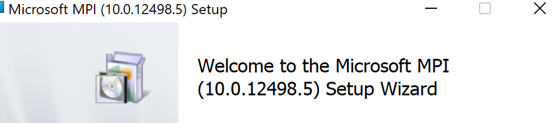

- `pip`本身来源：`python3-dev`带上。或者`python2`环境中的`sudo apt install python-pip`
- 普通使用：直接`pip install 包名`
- 从源码安装python包（比如需要指定版本，比如conda和pip都找不到包时）
    - clone源码，进去
    - `pip install -e .`
    - 此时`pip list`可以看到有的包是在本地某个源码文件夹装的
- 批量安装依赖：有个`requirements.txt`里面一行一行写需要什么包，比如长得像
`gym==0.19`
`termcolor`
  - 然后`pip install -r requirements.txt`即可
  - 注：`requirements.txt`有时还能看到`git`开头的一些行，表示一些从git下载源码安装的包
- 当然，`pip install`有时需要一些更底层的依赖。也就是python包只是一些上层接口而已
  - 其实这个有点像vscode插件和python解释器的关系，参见[[general]]
  - 比如[[mujoco-py]]中的mujoco
  - 比如[[mpi4py]]中需要
    - linux先`sudo apt install libopenmpi-dev`使得有`mpi.h`头文件等
    - windows可以搜索安装microsoft mpi