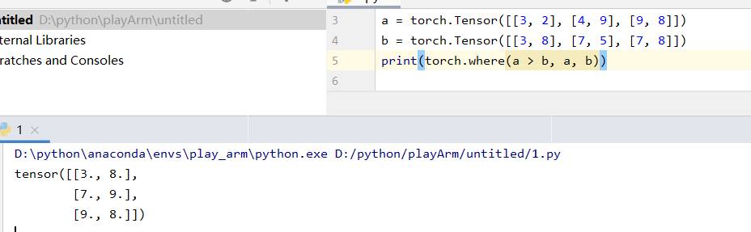

## torch.where()
这是一个神函数！tensor运算的条件判断万能函数！
基础用法：
`torch.where(condition, x, y)`
指逐元素判断condition是否成立，若成立，该元素取x中对应元素，否则取y中对应元素.
要求输入的condition, x, y均为相同size的tensor.
如：
`torch.where(x > y, x, y)`
为tensor x和y逐元素的较大值构成的tensor。

