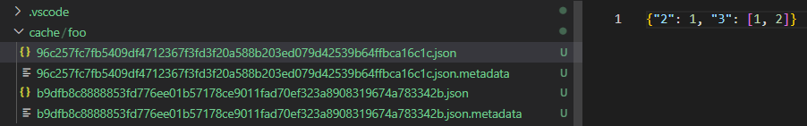

- [官网](https://pypi.org/project/cache-decorator/)
- 命令`pip install cache-decorator`
- 最简单使用

```python
from cache_decorator import Cache
from time import sleep
@Cache(cache_path='cache/{function_name}/{_hash}.json')
def foo(bar):
    sleep(5)
    return {2 * bar: bar, 3 * bar: [bar, 2]}

print(foo(1))
print(foo(2))
print(foo(1))
```
- 出现这种文件 
- 注：大括号中除了可填`function_name, _hash`（当实参[[hashable]]时），还可填许多别的东西
  - 如：有`str`类型参数时可以`{形参名}`这样
- 注意需要检查函数`return`结果是否可以存成指定格式！如`.pkl`要参考[[availability]]. 否则用不了