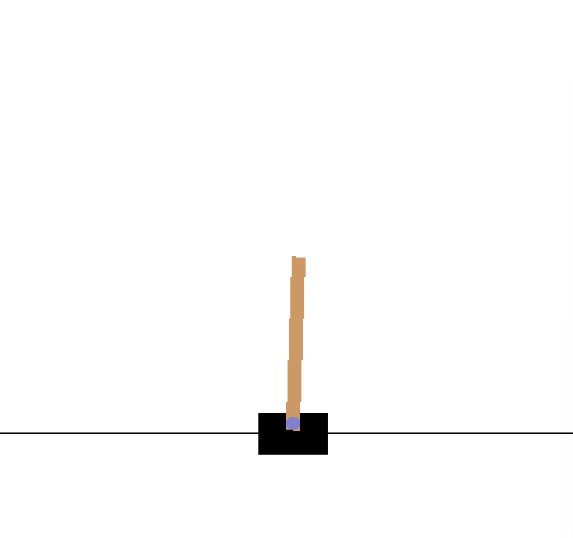
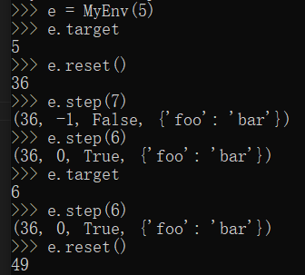
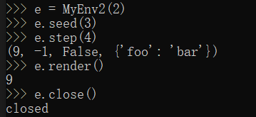

[toc]
## 前置
- `pip install gym[all]`
  - 你如果只`pip install gym`就只能使用一部分功能，比如`CartPole-v1`环境的`.render()`用不了
## 调用现成环境
- 有些字符串作为标识符，是[[register-classes]]了的。比如这里的例子`CartPole-v1`
### 初体验
```python
>>> import gym
>>> env = gym.make('CartPole-v1')
>>> env.reset()
array([-0.03896707,  0.04254232,  0.03542111, -0.01992345], dtype=float32) # 返回state
>>> env.render()
True
```
出现图片
### `.step()`
```python
>>> env.action_space
Discrete(2)
>>> env.step(0)
(array([-0.03668722, -0.1992439 , -0.03107222,  0.26346138], dtype=float32), 1.0, False, {}) # 返回state, reward, done, info
>>> env.step(1)
(array([-0.0406721 , -0.00369253, -0.02580299, -0.03885785], dtype=float32), 1.0, False, {})
>>> env.step(2) # Discrete(2)说明只有两种可能action
Traceback (most recent call last):
  ...
AssertionError: 2 (<class 'int'>) invalid
>>> for i in range(100):
...  _ = env.step(1) # 避免print出许多obs, done等输出
...  _ = env.render() # 避免print出许多True
```
可以看到不停`1`意为一直往右
## 写自己的环境
- [参考](https://blog.csdn.net/qq_33446100/article/details/118249795)
### 最简单：重载`__init__, step, reset`
- 定义环境
```python
from gym import Env
class MyEnv(Env):
  def __init__(self, target):
    super().__init__()
    self.target = target
  
  def step(self, action):
    obs = self.target**2
    rew = - (action - self.target)**2
    done = action - self.target < 1e-6
    info = {'foo': 'bar'}
    return obs, rew, done, info
  
  def reset(self):
    self.target += 1
    return self.target**2
```
- 尝试 
  - 注意：`done = True`并不直接导致`reset`！
### 进阶：重载`seed, render, close`
```python
class MyEnv2(MyEnv):
  def render(self):
    print(self.target**2)
  
  def seed(self, seed=None):
    self.target = seed
  
  def close(self):
    print('closed')
```
- 尝试 