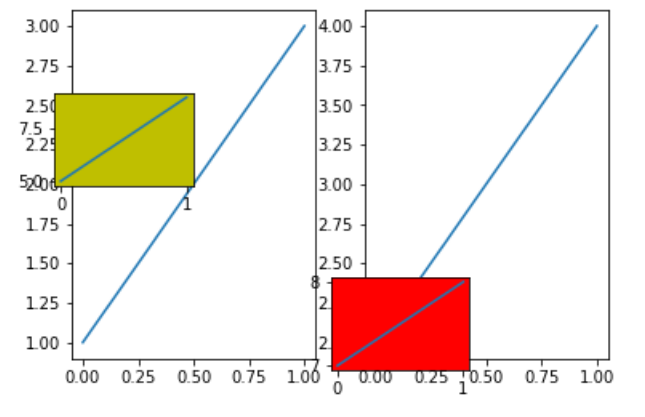

- 前置
  - [[matplotlib/basics]]
  - 可了解[[subplots]]
# 按一定模式添加子图`ax`
- [[subplots]]
- `ax2 = ax.twinx()`：x轴共用，y轴出现在右侧的另一个子图（即：子图间可以重叠）
# 自定义添加子图`ax`
- [[subplots]]是按规律排列的子图`axs`，那我们能不能指定位置添加子图呢？
- [参考](https://zhuanlan.zhihu.com/p/342422162)
  - `plt`和`fig`两者层级和使用场景不同，个别接口也有差异。比如`plt.axes()`和`fig.add_axes()`
- 典型使用`plt.axes((left, bottom, width, height), facecolor='w'`
  - 默认不加参数就是“整个”的大小
- 举例
```python
import matplotlib.pyplot as plt
fig, axs = plt.subplots(1, 2)
axs[0].plot([1,3])
axs[1].plot([2,4])
new_ax0 = plt.axes((0.5, 0.1, 0.2, 0.2), facecolor='r')
new_ax0.plot([7,8])
new_ax1 = fig.add_axes((0.1, 0.5, 0.2, 0.2), facecolor='y')
new_ax1.plot([5,9])
plt.show()
```

