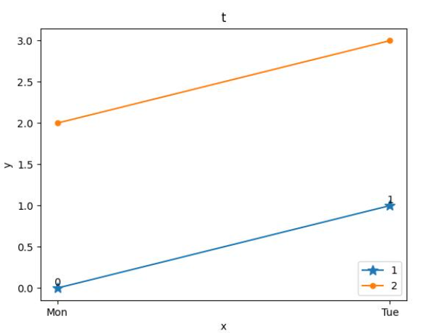

## 基础
- 安装`pip install matplotlib`
- 导入`import matplotlib.pyplot as plt`
- 最小的画图示例`x = ['Mon', 'Tue']; y = [0, 1]; plt.plot(x, y, marker='*', markersize=10); plt.savefig('minimum.jpg')`
- 在`plt`定义后，`savefig`前，还可以插入更多东西，在图上画出更多
  - `plt.title('标题')`
    - 注：中文可能比较麻烦
  - `plt.xlabel('x轴标签说明')`
  - `plt.ylabel('y轴标签说明')`
  - `for x_point, y_point in zip(x, y):`
    - `plt.text(x_point, y_point, '注释', ha='center', va='bottom', fontsize=10)`
    - 添加注释（`'注释'`常为`str(y_point)`）
  - `plt.legend(loc='lower right')`
    - 加入图例
    - 注：这时需要前面`plot()`里加入`label='标签'`关键字参数
  - 多次`.plot`，设置不同标签，画出多条线
## 基础示例
```python
import matplotlib.pyplot as plt
x = ['Mon', 'Tue']
y = [0, 1]
plt.plot(x, y, marker='*', markersize=10, label='1')
plt.plot(x, [2, 3], marker='.', markersize=10, label='2')
plt.title('t')
plt.xlabel('x')
plt.ylabel('y')
for x_point, y_point in zip(x, y):
    plt.text(x_point, y_point, str(y_point), ha='center', va='bottom', fontsize=10)
plt.legend(loc='lower right')
plt.savefig('example.jpg')
```
