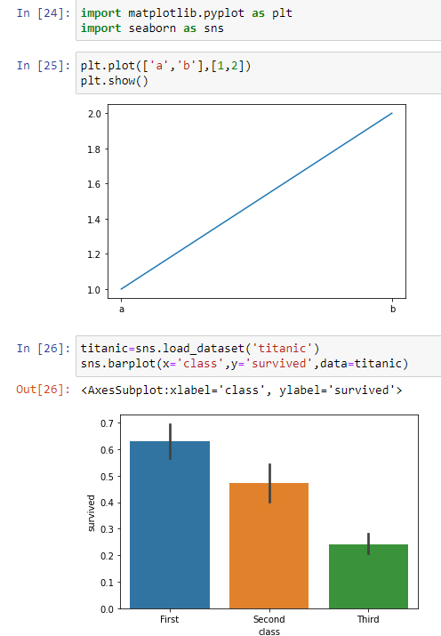
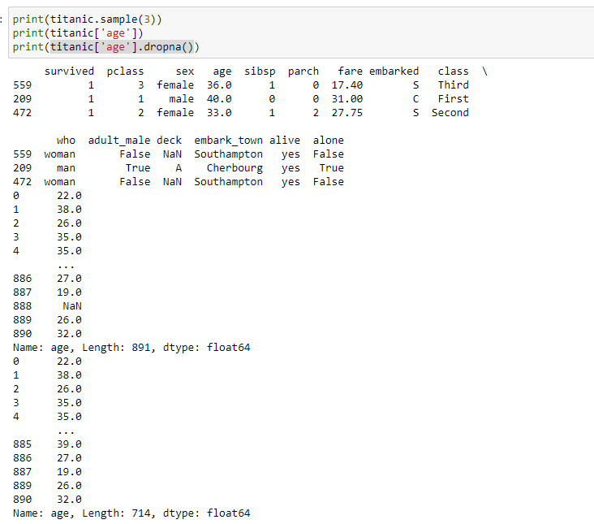
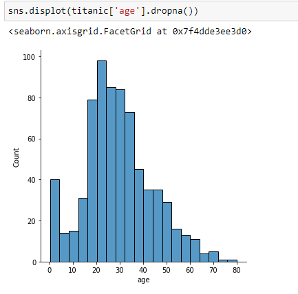

- 前置
  - [[matplotlib/basics]]
  - [[leaky-abstraction]]帮助理解和[[matplotlib/basics]]的关系
- 第一个示例：`barplot`
  - “不同舱位的存活率”
  - 
  - 注意使用了`seaborn`内置的数据集`titanic`
  - 代码：`titanic=sns.load_dataset('titanic'); sns.barplot(x='class',y='survived',data=titanic)`
  - 其中`class`是字段名，你也可以`titanic=sns.load_dataset('titanic'); sns.barplot(x='sex',y='survived',data=titanic)`
- 去除`NaN`：
- 针对某一key的`displot`：
  - “年龄分布”
  - `kde=True`：密度曲线
  - `bins=<分组数>`
  - 更多参数问问万能[[chatgpt]]，比如曲线平滑程度，标题等
- 不想用已有数据集，想要最简示例？

```python
sns.barplot(x='a', y='b', data={'a':['1'] * 3 + ['2'] * 5, 'b': [True] * 5 + [False] * 3})
sns.displot([1, 2, 3, 3, 3, 4, 4])
```
- [[subplots]]示例：可以用`ax`关键字参数
```python
import matplotlib.pyplot as plt
import seaborn as sns
fig, axs=plt.subplots(1, 4)
l = [1] * 3 + [5] * 7 + list(range(8, 12))
for cumulative, kde in [[True, True], [True, False], [False, True], [False, False]]:
    sns.histplot(l, ax=axs[cumulative * 2 + kde], cumulative=cumulative, kde=kde)
```