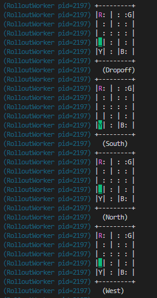

- [文档](https://docs.ray.io/en/latest/rllib/index.html)
  - 注意适用版本`1.13.0`
- 前置
  - （可选，推荐）[[conda/installation]]
  - [[pip]]
  - [[pytorch/basics/installation]]或tensorflow
  - [[gym/env]]
- 按照文档安装
    - `pip install "ray[rllib]" tensorflow torch`（当然也可只装一部分，如`pip install "ray[rllib]" torch`
    - `pip install "gym[atari]" "gym[accept-rom-license]" atari_py`（用于运行atari示例）
- 官网的第一个示例：[参考](https://docs.ray.io/en/latest/rllib/index.html)
  - `from ray.rllib.agents.ppo import PPOTrainer`
  - 设置`config`字典，例如
    - `>>> config`
    - `{'env': 'Taxi-v3', 'num_workers': 2, 'framework': 'torch', 'model': {'fcnet_hiddens': [64, 64], 'fcnet_activation': 'relu'}, 'evaluation_num_workers': 1, 'evaluation_config': {'render_env': True}}`
  - 使用`config`初始化`trainer`
    - `trainer = PPOTrainer(config=config)`
  - `trainer.train()`训练
    - 返回值有很多相关信息
  - `trainer.evaluate()`验证，出现这种图像，其含义也很直观 