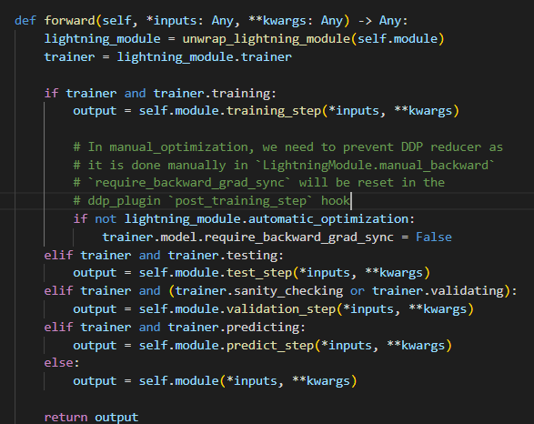

- 前置
  - [[basics/optimization]]
  - [[tensorboard]]
  - `pip install pytorch-lightning`
- 内容
  - [参考](https://www.pytorchlightning.ai/)，里面有一个用MNIST训练auto encoder的例子
  - [[dataloader]]不变
  - [[model]]改成继承`pl.LightningModule`
    - 回忆：继承`nn.Module`需要重载`__init__()`, `forward()`
    - 现在它的官方示例还重载了`configure_optimizers()`, `training_step()`, `validation_step()`（至少要重载这些！）
      - 具体找`lib\python3.7\site-packages\pytorch_lightning\overrides\base.py`，看到以下代码，就知道这些方法分别在何时被调用
      - 
    - 这里的一个`LightningModule`相比原始`torch.nn.Module`来说更为宏观
      - 例如auto encoder的整个结构，我们称为一个model
      - forward时只需要过encoder，计算loss需要encoder和decoder
      - 如果是原始的pytorch，肯定要把encoder和decoder分开
    - 拓展：`training_step`如果`return None`那就是无需[[deep-learning/optimization]]的。比如[[linalg]]提到的那种`lstsq`直接算出`w, b`
      - 但这时千万注意别错误加上了weight decay这种幺蛾子哈哈哈
- 使用
  - 初始化trainer: 例如官网给出的`trainer = pl.Trainer(gpus=4, precision=16, limit_train_batches=0.5)`
    - 详见[[trainer]]
    - 此处还可以指定一系列参数
  - 使用trainer拟合（训练）: 例如`trainer.fit(model, train_loader, val_loader)`
  - 测试：[参考](https://pytorch-lightning.readthedocs.io/en/latest/common/evaluation_basic.html#add-a-test-loop)，例如`trainer.test(model, test_loader)`
    - 当然，相应的你的`LightningModule`也需要重载`test_step()`
    - 注意：如果需要测试整个文件夹里所有[[checkpoint]]，请一定注意[[os-shutil]]中`os.listdir()`不保证按顺序
  - 参考`example.ipynb`的`basics`节，对比使用lightning和不用的写法
    - 原始代码来自[[basics/optimization]]中提到的`pytorch/basics/minimum.ipynb`
- features
  - 默认设置在训练前会先`val`一下（默认过俩batch，不是全过哈），称为`sanity_check`
    - 可确保`val`可以正常进行，这是[[general-principles/debug]]的思想
    - 有时会带来一点小麻烦
      - 比如[[linalg]]中“最小二乘法”那里
      - 比如你使用了[[hook]]，在`on_validation_end`这种地方记录[[tensorboard]]结果，那么sanity check本来是不该被记录的，却被记录了
  - 训练过程中自动调用[[third-party-modules/tqdm]]（或jupyter中的[[jupyter-tqdm]]）显示结果
  - 定期自动存[[checkpoint]], [[lightning/logs]]等，非常方便
    - 存、取、用checkpoint参考[[checkpoint]]
  - `training_step(train_batch, batch_idx)`这种地方的`train_batch`会自动被lightning转移[[device]]，你不用担心是不是在gpu上
    - 然而，你如果自己在`__init__`里之类的地方定义tensor，可能就需手工转移