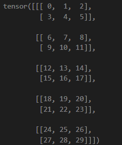

- 前置
  - `.shape`看到形状
  - 张量维数：即`Shape`元组的长度。比如3维是RGB图，4维是视频，5维是视频batch等
  - 向量维数：即`Shape`各元素乘积，直接反映数据量多少
  - `torch.arange`可以方便得到非平凡张量用于调试，且方便看到顺序
- `continguous`问题：todo
- `Tensor.unsqueeze()`提升张量维数，但不改变向量维数
  - 例如`torch.rand(3,3).unsqueeze(1).shape`为`(3, 1, 3)`
- `Tensor.expand()`改变形状（具体地，对于某维度只有`1`时，重复内容）但不拷贝相同的值
  - 例如`torch.rand(3,1,3).expand(-1,12,-1).shape`为`(3, 12, 3)`
- 前两者可结合使用
- `Tensor.view()`直接指定输出形状（可以用`-1`表示自动补全）
  - 例如`torch.arange(30).view(5, 2, -1)`输出结果
  - 
- 如果`view`不兼容（遇到`continguous`问题），则需要`reshape`
- `view`和`reshape`时，尽量多使用原张量的`.shape`里的数字，少使用[[magic-number]]
  - 比如你指定了`batch_size`为4096，可能以为所有输入的形状第0位都是4096，但实际上，最后可能除不尽，剩下某个不是的！