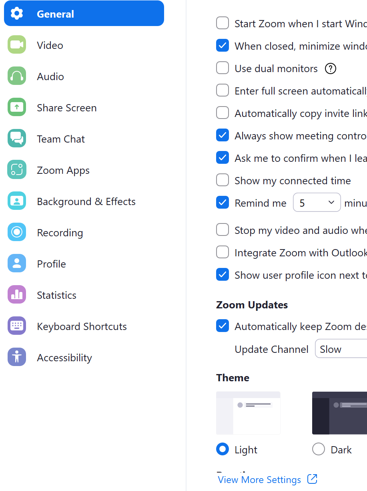
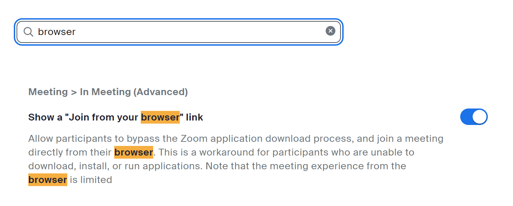
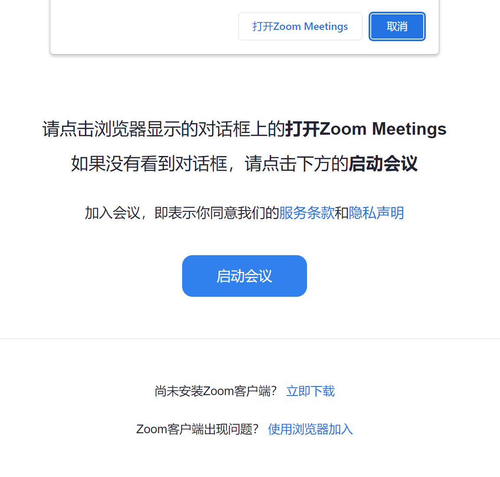
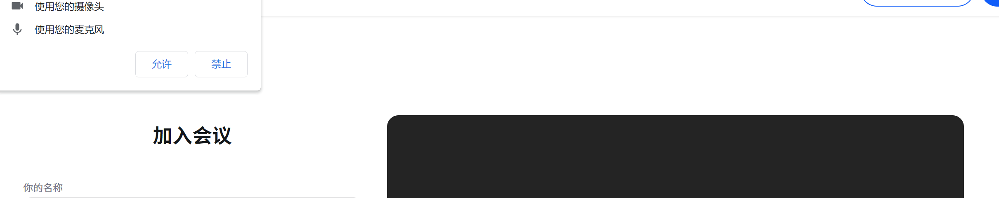

- 关于代理
  - 一个坑：zoom客户端用不了，但浏览器启动可能上得了
  - 因为客户端可能没正常走代理，浏览器正常走你浏览器代理
  - 参考[[proxy-basics]]
  - 如果你用google等需要代理的账户登录zoom，则登录那一下当然要开代理，但是登录之后就可以又关掉，以确保连接速度。这是[[temp-solution]]思想
- 可以官网下载插件从而可和[[outlook]]联动
- 开着会议时可能导致听音乐音质变差（因为音乐和语音不同）
# [[account]]
- 启动会议需要登录，加入不需要。也可直接浏览器
  - 因此一个账户就可以用两个浏览器例如[[chrome]], [[edge]]自行测试功能，例如[[tools/zoom#transcription]]
# transcription
- 自动听写字幕
- 前置：[[laptop-camera]]，[[chrome/settings]]
- zoom客户端设置，找到 view more settings
- 进去网页搜索`browser`，打开第一个选项 
- 之后会议可以在浏览器打开
  - 可能需要通过“取消”等不允许打开zoom应用，才能弹出下面这个选项“使用浏览器加入”
  - 
  - 然后效果
- 之后参考[这个](https://zhuanlan.zhihu.com/p/346845837)和[[chrome/settings]]即可
- 注：[网页版zoom](https://us05web.zoom.us/)