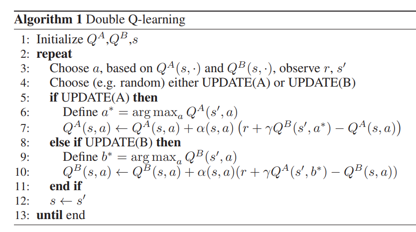

- 前置
  - [[q-learning-overestimation]]
- [[q-learning-overestimation]]后果：[[q-learning]] $Q$越更新越高估，影响性能
- [double q-learning](https://paperswithcode.com/method/double-q-learning)
  - 不直接使用$max_a Q$，而是两个$Q$，且每次“交错”，用其中一个网络argmax得到$a^*$，用另一个网络计算$Q(s',a^*)$
  - 
    - 注意对应两个网络（两个估计量），有两种可能情况
- 是[[q-learning-overestimation#double estimator]]直接应用