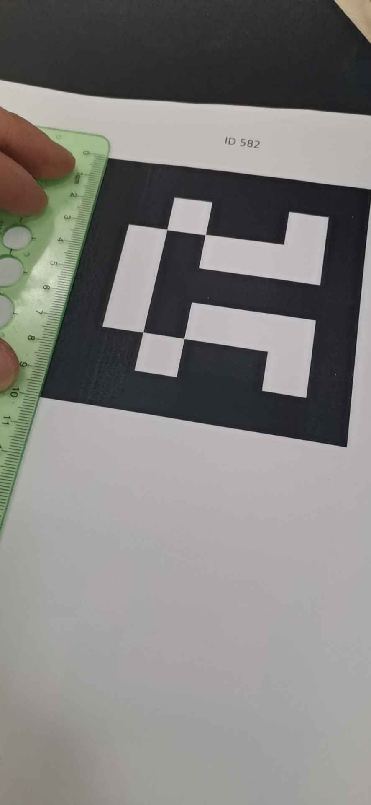
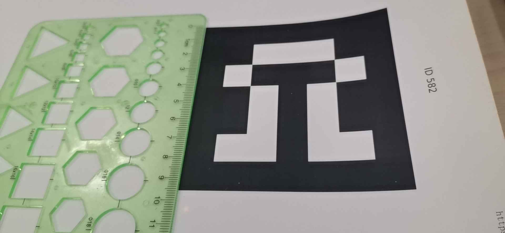

前置：
- ros中使用相机，即[[realsense-ros]]，[[usb-camera-ros]]等中一个
- 了解[[roslaunch]]修改和传递参数
- 打印机

fiducial markers是什么？[维基](https://en.wikipedia.org/wiki/Fiducial_marker)
ArUco就是一种fiducial marker
- [ArUco](https://docs.google.com/document/d/1QU9KoBtjSM2kF6ITOjQ76xqL7H0TEtXriJX5kwi9Kgc/edit)
  - [其ros包](https://github.com/pal-robotics/aruco_ros/tree/melodic-devel)，是一层封装
  - ros包readme也太简略了。好在[ArUco](https://docs.google.com/document/d/1QU9KoBtjSM2kF6ITOjQ76xqL7H0TEtXriJX5kwi9Kgc/edit)这里写了要`-DOpenCV_DIR`

安装
- [ArUco](https://docs.google.com/document/d/1QU9KoBtjSM2kF6ITOjQ76xqL7H0TEtXriJX5kwi9Kgc/edit)中搜索Compiling即可看到相关文档
- 但你不用全听他的。你明白他在做什么，就可以：
- 参考[[cmake]]中的[opencv链接](https://docs.opencv.org/4.2.0/d7/d9f/tutorial_linux_install.html)安装依赖OpenCV
  - 可能需要[[cmake]]配置[[configure]]代理
- 参考[[install-ros-package]]所说的“多`git clone https://github.com/pal-robotics/aruco_ros.git`”
  - 其余命令参考[[install-ros-package]]不变
  - 注意版本号可能是`melodic`，就需要`-b`参数指定`melodic-devel`
- 即可用`catkin_make -DOpenCV_DIR=<pathTo-OpenCVConfig.cmake>`安装
  - 怎么找到那个文件`OpenCVConfig.cmake`？
  - 刚刚那个[opencv链接](https://docs.opencv.org/4.2.0/d7/d9f/tutorial_linux_install.html)让你在`/usr/local`装了
  - 所以你就`find /usr/local | grep CVConfig\.cmake`
  - 注意`grep`区分大小写
  - 最后显然不要用源码`/src`里的，要用`/usr/local/lib`里的

实体准备
- 下一节所说`single.launch`里能看到id为582，所以我们去https://chev.me/arucogen/
- 
- 如果选择默认的100mm，对应0.1m，在`single.launch`中需要改
  - 当然也可选择其它id和大小，相应改即可
- 点下方open打印成pdf
  - pdf再去打印机打印。注意不能缩放，完了之后要确认大小对不对
  - 对的：
  - 不对的：

使用
- `roscd aruco_ros/launch`，`vim single.launch`
- 启动相机（比如[[realsense-ros]]）
- `rostopic list`找相机相关的两个话题，填到`launch`文件中相应地方
  - 找`/camera_info`和`/image`
  - 如果你找不着`rect`的topic，也不需要改`image_is_rectified`为`False`. 这里的raw其实一般内参是标定过的（即使没标定过误差也不大）
    - 改了`False`反而会导致误差很大
- （py2环境）`rosrun rqt_tf_tree rqt_tf_tree`
  - 看图，知道`camera_frame`，`reference_frame`参数应该填`camera_color_optical_frame`（因为这是单目相机）
  - 注意这里是最简单的setting：标定一个marker相对相机`*optical_frame`的位置
- 注：其实`reference_frame`不一定得是`camera_color_optical_frame`
  - 它可以是`camera_link`
    - 这是相机的“base”，类比[[moveit-installation]]中机械臂的`panda_link0`
    - 注意它和`*optical_frame`不一定相同
    - 标定`*optical_frame`对于[[get-pointcloud]]等应用是最方便的。毕竟拍照对应的是`*optical_frame`
      - 也就是可以用结果直接[[mul-inverse]]等
  - 它甚至可以是任何其他能找到确定联系的坐标系。比如你可以标定两个`ArUco`码的关系
  - camera自己的各个坐标系间关系对应真实世界中深度镜头和rgb镜头的位移等等。在[[rviz-tf]]中可以看到它们原点很近但不完全重合
  - 应用：[[hand-eye-calibration]]中如果希望[[rviz-tf]]可视化出来，那就要选`camera_link`（根连根）
- 根据上一节“实体准备”填写id和大小（注意单位是m）
- 调好所有后
  - [[realsense-ros]]驱动启动（`roslaunch realsense2_camera rs_camera.launch`）
  - `roslaunch aruco_ros single.launch`
  - `rqt_image_view`看效果

结果获取
- `rostopic list`看到topic名，所以可以`rostopic echo /aruco_single/pose`
  - 可以用手遮挡让它停下。这样可以“人走过去，标定个位置，再回到电脑前”一人搞定而不需要两人
  - 不过如果不是直接的而是间接的（比如你的`launch`写的是`camera_link`为ref，但想要`camera_color_optical_frame`为ref的结果，那么就不能这么操作，因为只有`/aruco_single/pose`实时有值才可以`rosrun tf tf_echo`