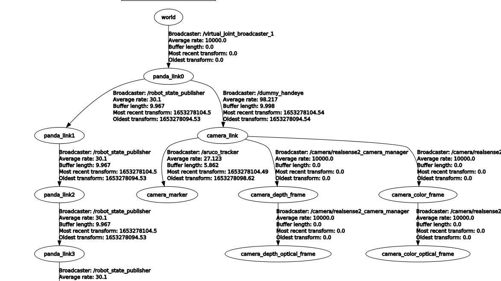
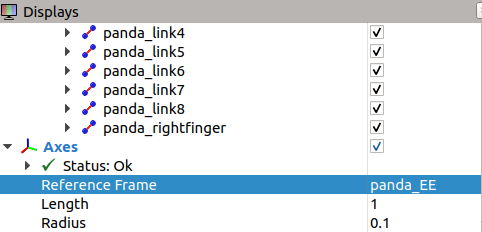
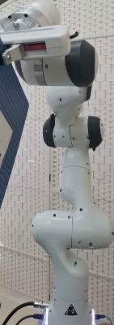
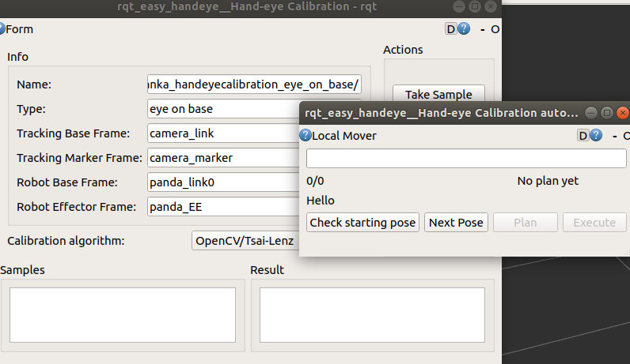
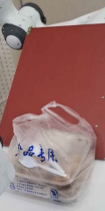
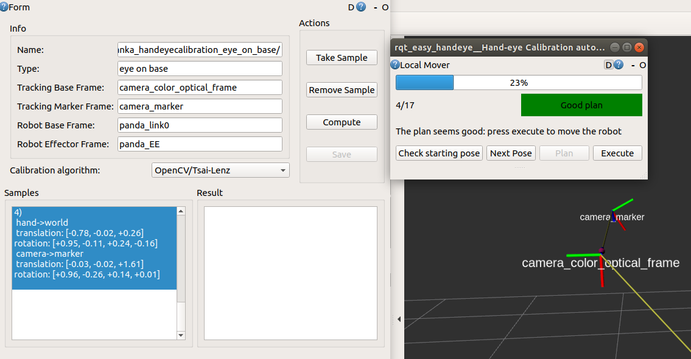
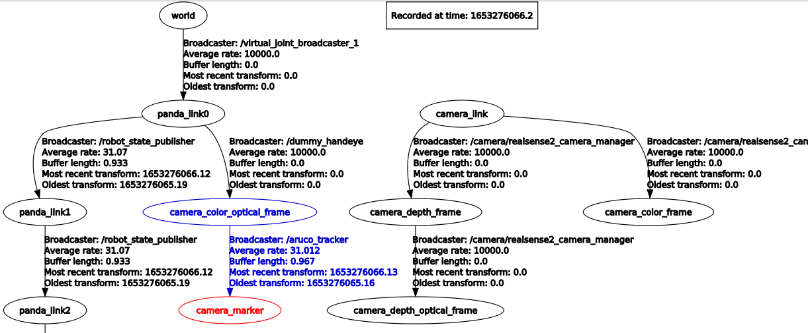
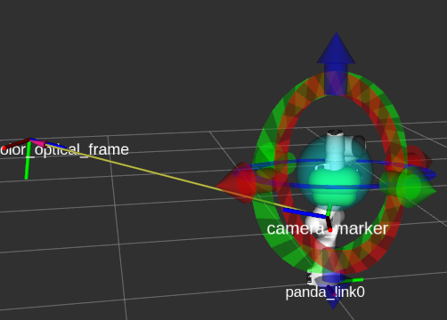
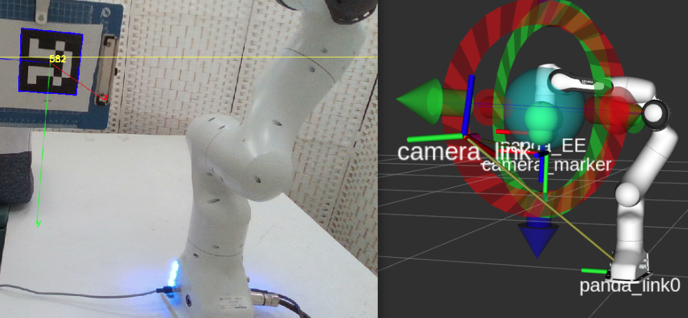

前置
- [[aruco]]
  - 附着在硬纸板上，让机械臂夹住
  - 也可以选择其它固定方式，比如粘在硬纸板，硬纸板粘机械臂
- [[realsense-ros]]
- [[franka-ros]]
- 手眼标定原理
  - 简单了解eye-on-hand, eye-on-base
  - 比如eye-on-base时，要知道为什么说“marker和end-effector相对位置关系稳定（加紧）即可，对于到底是多少没有要求”
- [[rviz-tf]]，[[quaternion]]你要是懂，则有重大帮助，能粗略评估是否准确
- “抓紧”物体的命令，例如[[franka-ros-interface]]的
  - 原型：`grasp(width, force, speed=None, epsilon_inner=0.005, epsilon_outer=0.005, wait_for_result=True, cb=None)`
  - 实用中可以`grasp(0.02, 100, epsilon_inner=0.1, epsilon_outer=0.1)`确保夹住
## 安装
```shell
git clone -b melodic-devel https://github.com/lagadic/vision_visp.git
git clone https://github.com/IFL-CAMP/easy_handeye
```
参考[[install-ros-package]]的做法安装
## 配置
原理上是[[roslaunch]]多个东西。你可以分别启动，也可以写一个`launch`文件自己启动
`vim $(rospack find easy_handeye)/../docs/example_launch/ur5_kinect_calibration.launch`里面是示例
可以直接修改它为我们要用的，使用[[aruco]]，[[realsense-ros]]，[[franka-ros]]
- 一来名字，ip，`marker_size`，`marker_id`怎么改是显然的（参考[[connect-controller]]，[[aruco]]）
- 启动相机的部分：
```xml
    <!-- start the Realsense camera -->
    <include file="$(find realsense2_camera)/launch/rs_camera.launch" />
```
- `start ArUco`部分：参考[[aruco]]修改topic等即可
- 机械臂部分：
  - [[moveit-real-robot]]中提到`roslaunch panda_moveit_config panda_control_moveit_rviz.launch robot_ip:=172.16.0.2`
  - 所以我们写
```xml
    <include file="$(find panda_moveit_config)/launch/panda_control_moveit_rviz.launch">
        <arg name="robot_ip" value="172.16.0.2" />
    </include>
```
- `easy_handeye`本身部分
  - `eye_on_hand`：如果第三人称（眼不在手上），为`false`
  - `tracking_base_frame`直观含义上，当然要和`ArUco`一节的`reference_frame`一致
  - `tracking_marker_frame`要和`ArUco`一节`marker_frame`一致
  - 刚刚两个对应关系意思很显然
  - 注：我们选用`camera_link`，方便[[rviz-tf]]
    - 
    - 如果选择`*optical_frame`，好处是直接得到这个在[[get-pointcloud]]时方便；坏处是不连根节点，没法可视化
    - （其实`camera_link`也没有多不方便。参考[[tf-tree-connection]]，直接`rosrun tf tf_echo`即可）
  - `robot_base_frame`和`robot_effector_frame`可以参考[[moveit-real-robot]]里面的`launch`一下，在rviz里打开`Axes`的显示，就方便看是啥（参考[[rviz-tf]]）
    - 
    - 结果：是`panda_link0`和`panda_EE`
    - `panda_EE`其实还有多种选择，比如`panda_link8`，本质上根据手眼标定原理，只要相对marker的transform稳定即可
  - 还有一个参数`move_group`可能需要override一下
    - 可以看`<path/to/>easy_handeye/easy_handeye/src/easy_handeye/handeye_calibration.py`
    - 默认是`manipulator`，这可能是不存在的，需要改成`panda_arm`之类
- 配置完，放到`$(rospack find easy_handeye)/launch`下，任取名字
  - 示例：本文件夹里的那个`.launch`
## 启动标定
- 首先机械臂夹紧码
  - 如果纸板太薄可以考虑加点轻厚泡沫**配厚**
  - 还可以在之后`.launch`里减小速度加速度，使得更保险
  - 
  - 次序：**首先**安排机械臂位置必须是非常“好”的，接近于“neutral”值，非常“中正”（如上图）
    - 这样机械臂end-effector才可以在附近自由运动
    - 如果机械臂位置不好，可能在之后第一次点`Next Pose`时终端出错误说这个位置不能标，导致只能重新来
    - 当然，如果处于neutral位置不方便，可以转最底下的link1（但上面保持不变）
  - **其次**再放相机，保证marker在视野中央，marker角度合适（尽量“正”，有空间），同时该角度拍到待操作物体效果好
    - 比如肯定要正常拍到目标物体
    - 比如该角度下[[get-pointcloud]]质量好
  - 当然还需要
    - 机械臂能够到待操作物体（物体不能太靠近base也不能太远离）
    - 机械臂base不遮挡物体等
    - 依赖项很多！
  - 确认没问题再开始标定
- py2.7环境，机械臂处于**蓝灯**，`roslaunch easy_handeye <刚刚的名字>.launch`
  - 跳出很多GUI，下面的大称为**1号**，小称为**2号**
  - 
  - 1号用于采集
  - 2号用于指示运动
- `rqt_image_view`打开后在左上角的topic处选择`/aruco_tracker/result`
  - 确保能看到aruco码被detect到
  - `rqt_image_view`窗口对于重新launch的相机节点需要刷新
- 在采集过程中会碰到如下不良情况
  - 相机节点刚启动，画面偏暗，还没检测出码，不要急着点`Take Sample`，否则会crash
  - 码检测不准确，码的边框在持续晃动或者码时有时无，这说明检测不稳定，一般不建议采集此点，可直接跳过当前位置
  - 无法检测到码，一般因为反光，角度不好等原因会出现码无法检测到的情况，对于这种情况，也直接跳过当前位置
    - 对于这种情况，千万不要点`Take Sample`，这会导致程序直接crash
    - 所以说全程监视`rqt_image_view`是不可或缺的
    - 一个趣味图：强行挡光！这里挡的是另一台机械臂的白灯
- 标定过程中可以参考[[rviz-tf]]做这种可视化，确认没问题
  - `rqt_tf_tree`要在py2运行`rosrun rqt_tf_tree rqt_tf_tree`
  - 此时位置关系可能是不对的。`rqt_tf_tree`可以看到“dummy”。此处只是占位符
- 2号`Check ...`，之后`Next, Plan, Execute`循环，每次循环让机械臂运动到新的位置
  - 每运动到一个新的位置，点（可以是很多次）1号GUI中的**Take Sample**，看到数据被记录
  - 以此类推，直到点全部采完
  - **不要不Check直接点Next**，否则无法正常开始流程
- 全部检测完成后，点击1号GUI中的**Compute**得到结果[[quaternion]]
  - 可以根据[[quaternion]]判断结果是否靠谱
  - 不过过程中也可以compute，一来看“收敛性”，二来可以作[[before-long-run]]的小测试
  - 但大于等于3个sample才能“小测试”，否则直接crash
## 保存 可视化
- 1号save保存，保存结果会到一个隐藏文件夹下的`.yaml`，之后就可以使用`publish.launch`，参数写法参见本文件夹中的文件
  - 注：以后就可以直接publish使得该transform可被[[rviz-tf]]使用并可视化
- 退出刚刚手眼标定的`.launch`，重新`rqt_tf_tree`，看到不再是dummy了（不过目前tree上只有一个transform）
- 这时再launch[[realsense-ros]]，[[moveit-real-robot]]，[[aruco]]，即1+3共4个transform broadcaster，也就得到了`world`中`camera_marker`的位置，即可可视化标定结果
  - 
  - 还可以和[[rqt]]中的`rqt_image_view`一起使用，非常直观
    - ，marker确实在EE下面一点
    - 当然这里可能有小问题：有的地方认为marker法向量是x，有的认为是z
  - 看起来marker位置挺对劲的