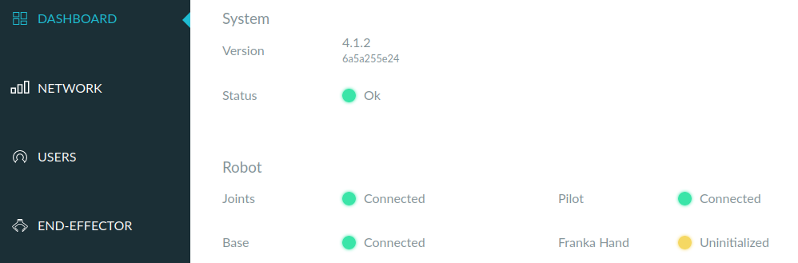

- 如果（比如你手动动了gripper，或者重启电脑等），就需要在END-EFFECTOR选项卡处Homing
  - 参考[issue](https://github.com/frankaemika/franka_ros/issues/16)
  - 尽量不要手动动gripper
  - 如果直接显示红色（未连接），那homing可能没用，重新插拔网线试试。如果变黄就再homing
  - 也有可能是[[franka-panda/limit]]问题
- [[moveit-real-robot]]的命令无法运行时，可以看[[fci]]的`communication_test`怎么样，再进一步看`ping <fci-ip>`延迟是否压到0.2ms左右，还能用[[control-using-desk]]看看情况
  - 逐级排查！看问题到底出在哪
  - 这是[[leaky-abstraction]]的思想
- 如果`communication_constraints_violation`那么
  - 可能是通信问题，[参考这个](https://frankaemika.github.io/docs/troubleshooting.html#motion-stopped-due-to-discontinuities-or-communication-constraints-violation)提升CPU，网络性能等
    - 并且换个好的网线！实践证明好的网线可能让`ping`延迟直接变为三分之一
    - [官网说](https://frankaemika.github.io/docs/troubleshooting.html#simple-ping-tests)`ping`延迟1ms以下就行。**但实践证明需要0.2ms左右**，否则`communication_test`无法运行
  - 可能是物理原因导致的`reflex`错误（提示信息会写），[参考这个](https://frankaemika.github.io/docs/libfranka.html#errors)可能解决
  - 注：这种报错有时甚至会导致之后各种让机械臂运动的命令都用不了，连软件recovery也没用，[[fci]]的`communication_test`一直提示`libfranka: Set Joint Impedance command rejected: command not possible in the current mode!`，这时必须手动白灯再蓝灯（哈哈，于是联系了下一条troubleshooting）
- 白灯再蓝灯后，[[moveit-real-robot]]的`roslaunch`命令需要重新启动
- 红灯重启时可能也需要手动白灯复位到合理位置
- 装[[libfranka]]如果是超级用户，之后可能有权限问题。`communication_test`需要[[sudo]]