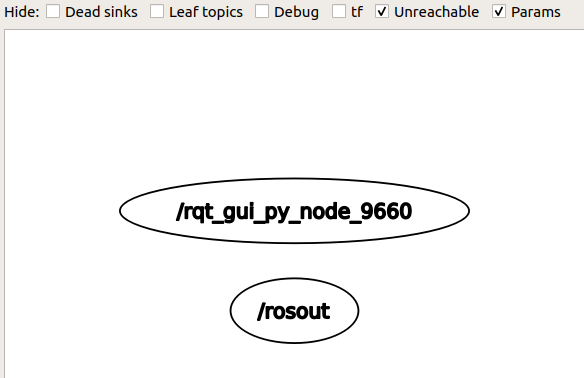

前置：
- [[linux]]翻墙
- 针对`raw.githubusercontent.com`修改[[hosts]]（因为`rosdep init`的代理[[configure]]很麻烦）
- [[software-management/source]]
  - 除了需要加ros的源，可能还要改默认源为阿里云（默认源缺包）

这是`melodic`版本（比较古早）版本是按照字母`a`开始排列的
- 注：版本不同，加的软件[[software-management/source]]不同
  - `melodic`版本只能安装`ros-melodic-<名字>`，如果安装`ros-<其他版本>-<名字>`就会报找不着包
  - 所以[[read-doc]]时不能总是照搬命令

参考[官网文档](http://wiki.ros.org/melodic/Installation/Ubuntu#Installation)，对着不断输入命令即可
- 如果你用[[zsh]]那么，要`source`的文件以及需要把`source`语句加到的文件都有区别
- 注意1.5节中提到：多个ros版本只能`source`一个`setup.bash`
  - 那我们就认准`melodic`吧
## 验证安装成功
一个终端`roscore`
另一个终端`rqt_graph`，去掉hide中的勾选，看到`/rosout`
