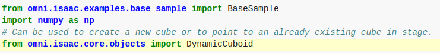

前置：
- [[isaac-sim/basics]]
# extension
- extension这种workflow的特点：异步，hot reload，能由script window动态异步往上加东西，如[官网链接](https://docs.omniverse.nvidia.com/app_isaacsim/app_isaacsim/tutorial_required_workflows.html#extensions-primary-workflow
)所说
[[isaac-sim/basics]]里的键盘小车就是这种启动方式
  - [Hello world](https://docs.omniverse.nvidia.com/app_isaacsim/app_isaacsim/tutorial_required_hello_world.html)有详细教程
  - 这种workflow方便调试。所以可以先在这种workflow调试完毕，再[[ext-to-sa]]
- 热更新特性
  - 菜单Isaac Examples > Hello World打开窗口
  - 右下角第一个按钮打开源码
  - `title="Hello World Example"`修改，保存，发现热更新了（注：所以说请特别小心，isaac并不会保护它的源码，不要不小心乱改！）
- [3.3](https://docs.omniverse.nvidia.com/app_isaacsim/app_isaacsim/tutorial_required_hello_world.html#code-overview)world全局唯一，是和模拟器交互的主要界面
  - 是[[singleton]]，全局唯一，用法：`from omni.isaac.core import World`，`world = World.instance()`取用
- [3.4](https://docs.omniverse.nvidia.com/app_isaacsim/app_isaacsim/tutorial_required_hello_world.html#adding-to-the-scene)scene主要管理USD模型。
  - `class HelloWorld(BaseSample)`的`setup_scene`方法就指定初始`scene`
  - 比如`world.scene.add_default_ground_plane()`加了一个平面
  - 比如教程中`fancy_cube = world.scene.add(...)`又加了一个正方体（可以尝试保存`.py`文件，热更新）
    - 注：改了`setup_scene`，要`CLEAR`再`LOAD`，否则只`LOAD`即可。然后要播放键看效果。
    - 注：官网这里`import numpy as np`也是要加上的
  
  - 读取位置等属性：首先在`add`时指定名字`fancy_cube`，然后
```python
        self._cube = self._world.scene.get_object("fancy_cube")
        position, orientation = self._cube.get_world_pose()
        linear_velocity = self._cube.get_linear_velocity()
```
加在你想加的地方（官网加在了一个`async def setup_post_load(self)`处）
- 这种workflow是异步的，所以如果要每个physical step读取就要加[[callback]]. 具体地，在`setup_post_load`中额外`self._world.add_physics_callback`，再写一个callback