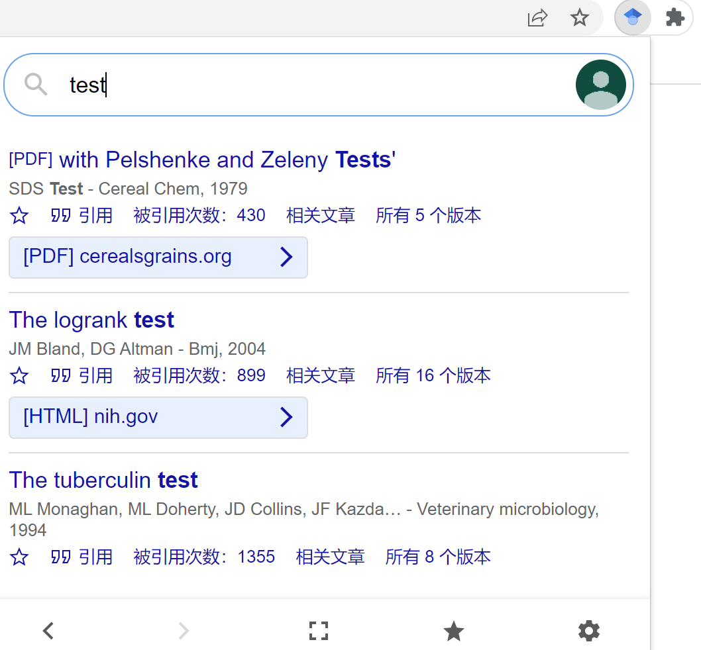

# 网站工具
- [google scholar](https://scholar.google.com/)
  - 还有[[chrome/extension]]，可以右上角浮窗搜
  - 
- [arxiv](https://arxiv.org/)
  - arxiv号码可作为某种id，便于搜索
- [Sci-Hub](https://www.sci-hub.st/)，直接搜名字往往就能找到论文/书
  - 这个当然争议巨大哈哈哈
# survey步骤
[一个知乎建议](https://zhuanlan.zhihu.com/p/210657720)
1. 领域入手
   1. 搜索关键词，直接读个3-5篇最近最知名的，先具有大概印象
   3. 特别要看related work章节
   4. related work本身就是小的survey
   5. 还可能直接指向survey paper
2. 如何拓展
   1. 看文章的引用篇目
   2. 由此总结相关人、会议期刊、重要著作等，从而去相关页面（会议主页、个人主页等）
   3. google scholar的related功能
   4. arxiv的related paper功能（这还能自动生成paper组成的graph，非常直观）