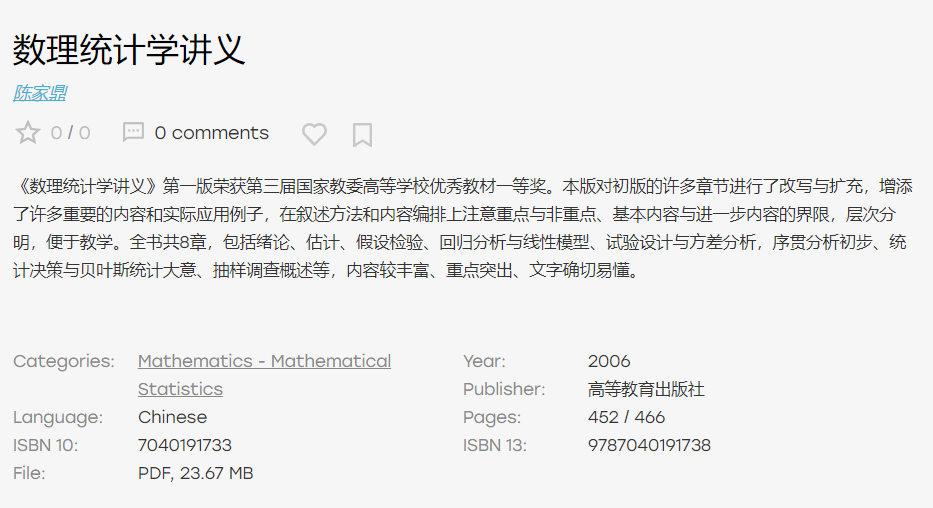

- 手机apk
  - m.apkpure.com
- 电子书
  - [z-lib](https://zh.z-lib.org/)官网（各种语言，各种格式）
    - 可能需要[[usage]]代理
    - [[usage]]代理导致ip太频繁，超过每天5本限制？用邮箱注册个账号就有额外的5本额度
- 资源有时有id（具有唯一性的标识符），就方便找
  - 比如有ISBN就方便去z-lib，有doi就方便去各类学术网站找等
  - ISBN：有10位的，有13位的，最后一位是校验码
    - 例如