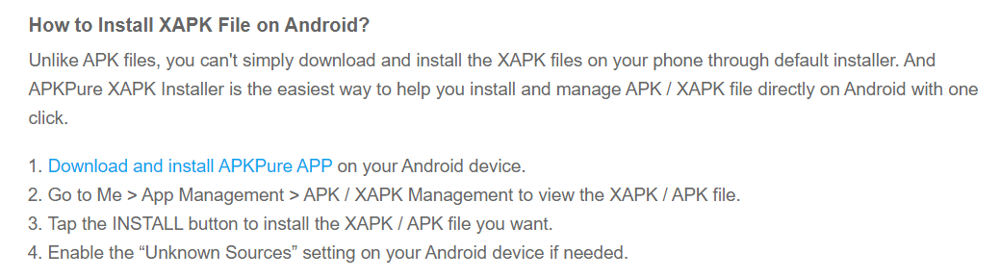

- 手机apk
  - m.apkpure.com（电脑手机都可访问该网址）
    - 也可以[手机上下载apkpure app](https://apkpure.com/how-to/how-to-install-xapk-apk)
      - 当应用商店、管理器使用
      - 可以下载一些国内应用市场没有的东西比如[[keybase]]、[[android]]代理客户端SSR等
      - 当电脑网址m.apkpure.com给出apkpure特有的`.xapk`格式文件，就可以考虑使用手机apkpure app而不是电脑下载`.xapk`传给手机。这样比较方便
    - 官网图：
- 电子书
  - [z-lib](https://zh.z-lib.org/)官网（各种语言，各种格式）
    - 可能需要[[usage]]代理
    - [[usage]]代理导致ip太频繁，超过每天5本限制？用邮箱注册个账号就有额外的5本额度
- 科学论文：[Sci-Hub](https://www.sci-hub.st/)，直接搜名字往往就能找到
  - 这个当然争议巨大哈哈哈
- 资源有时有id（具有唯一性的标识符），就方便找
  - 比如有ISBN就方便去z-lib，有doi就方便去各类学术网站找等
    - ISBN：有10位的，有13位的，最后一位是校验码
    - 例如，可以看到有10位和13位。有重合之处。校验码不同
  - 比如计算机等领域论文如果会放arxiv预印本，那就有arxiv序列号
  - 比如学术著作的doi号
- 盗版软件（破解[[version]]）
  - 上网找序列号，如[[pro-license]]，[[aida64]]
  - [[search-info/general]]中提到暗网海盗湾，[[telegram]]等地方可能有盗版安装包或序列号
  - [[internet-archive]]等地方可能有一些老古董已经公布免费序列号了
    - 参考[[win98-virtual]]
  - 专业工具站
    - 参考[[win7-virtual]]
    - [实用工具站点](https://msdn.itellyou.cn/)）