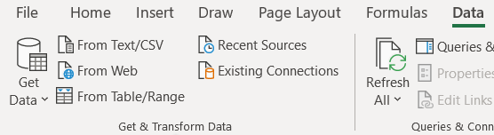

- 前置
  - [[tabular/source]]
- 表格（结构化）数据可以用作多种程序的输入
  - 其本身是文本[[file-format]]，所以可以由任何能读入文本的程序处理
    - 还有些包做了很方便的接口
      - 如[[time-series]]中`opsd_daily = pd.read_csv('opsd_germany_daily.csv')`
      - 注意选择`sep`参数（默认逗号）
  - vscode中[[excel-viewer]]可以打开预览`.csv`，`.xlsx`并作简单处理（如过滤、排序）
  - excel能打开：
    - 注意选择编码，分隔符等选项（回忆刚刚说`pandas`读入时也需要选择分隔符）