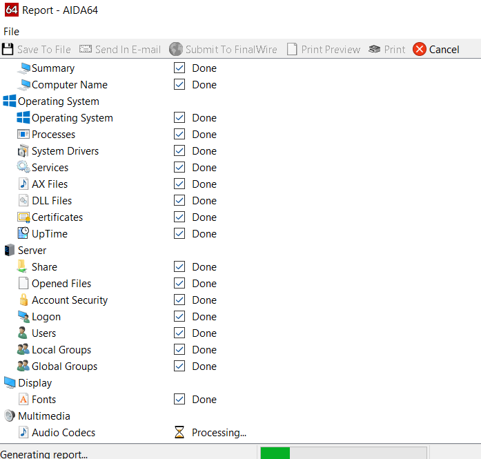
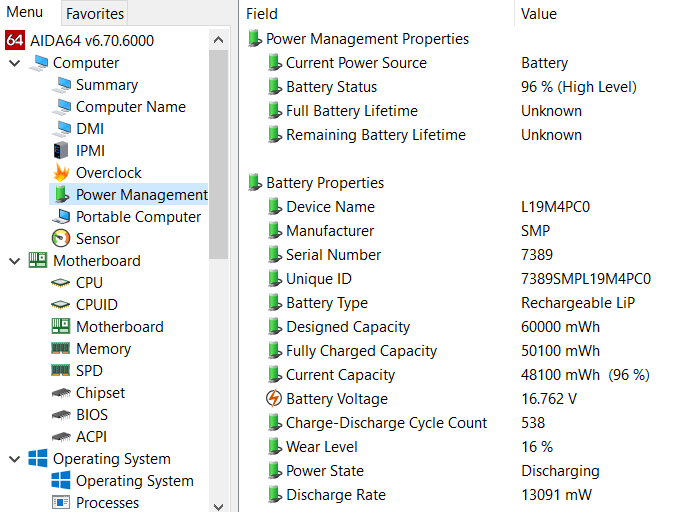
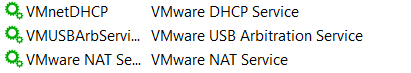
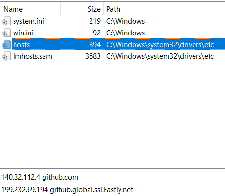

# 下载安装
- [下载](https://www.aida64.com/downloads)
- 百度找到的序列号
  - `UK4F4-3F2D6-FJD9J-C4D34-FYY12`
  - 2022.6可用，2022.12新版安装包不可用了
  - 但旧版安装包可能可用。所以今后不妨保留旧版安装包，参考[[version]]
- 一个[俄罗斯网站](https://keypro2.ru/aida64-extreme-edition-keys/)给的序列号：`U4T24-SFRDB-W9DN3-BDMTY-NYZGV`2022.12在`6.80.6200`版本[[version]]可用
# 实用功能
- 找不到这些功能在哪的自己探索
- 也可以[参考](https://zhuanlan.zhihu.com/p/349488218)
- 右键某个条目可以快速导出[[general-principles/logs]]或add to收藏
  - 哈哈，输出[[general-principles/logs]]方便别人修你电脑
  - 
- Computer
  - Summary常用信息，配置等
  - Power Management
    - 看[[devices/battery]]
    - wear level就是电池寿命的损耗
    - 看功率非常实用！
  - Sensor看温度，充放电情况等
- Motherboard
  - Memory看实际/虚拟内存以及Paging File
- Operating System
  - Processes检测进程
    - 部分代替任务管理器，下同
  - Services检测服务
    - 例如看[[network]]中需要的service开没开
    - 
- Storage
  - SMART：硬盘寿命
- Network
  - Windows Network看适配器，内网情况如[[network]]，[[wsl]]，[[wsa]]
  - Internet可验证[[proxy/basics]]的[[configure-proxy]]成功等
- Devices
  - `USB Devices`里面有USB及蓝牙设备列表（包括已配对但当前没连接的）
- Software
  - Auto Start深度清理[[startup]]
  - Scheduled清理软件
  - File Types看[[file-format]]关联
- Config
  - System Files看[[hosts]]等系统文件
    - 
  - System Folders
    - 里面有一些很有意思的，比如可以删除`SendTo`选项，删除`Start Menu`中快捷方式等
- Benchmarks跑分