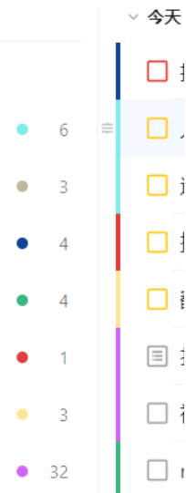

滴答清单是日程管理软件
- 优点
  - 各种循环很方便，特别是无限循环
    - 其inbox还可以识别一些自然语言，比如
      - 每两天剃须
      - 每两周周一中午12:00某某
      - 每40天某某……等等
  - 跨平台
  - [网页版](https://dida365.com)很方便（不过可能要关代理，参考[[proxy/usage]]）
    - 网页版可以直接鼠标点击条目编辑事项文字，太方便了
  - 习惯打卡机制
    - 不过免费版只有最多5个习惯可以用。请妥善利用“名额”
    - 可以搞出些“早上护肤剃须刷牙运动……”这种组合型习惯
- 手机app使用
  - settings - tab bar
    - 可以调整视图
    - 比如可以把“习惯”调出来
  - calendar选项卡
    - 右上角Today回到今天
    - 右上角第二个按钮：免费版只能使用List，不能使用其它的
      - 不过List已经很方便了。向上划变周视图、向下划有月历
    - 右上角第三个按钮（三个点）：可以设置等
      - 比如可以让循环任务只显示第一次，避免日历太满
- list机制
  - 默认全部放到inbox
  - 其实可以分成多个list（比如工作、学习、生活等），设置不同颜色，使得有这个效果
  - 在新建事件时，网页版可以先选择list再加，手机版有个按钮可以选择加哪个list（注意inbox和list是并列关系）
  - list的颜色和优先级的颜色（红黄蓝）是orthogonal的
- 缺点：有些功能（例如团队合作）不如[[flyele]]
  - 不过两个联合使用就爽了