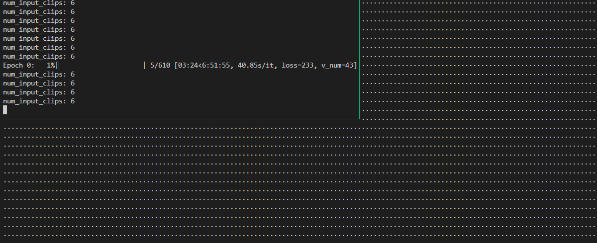

- `sudo apt install tmux`即可
- 命令
  - `tmux ls`列表
  - `tmux new -s <名字>`新建
  - `tmux a -t <名字>` attach
- 坑
  - **不同用户**（比如`root`和非`root`）能看到的`tmux ls`是各自独立的
    - 如果你`sudo su`了，就要注意！
  - 表面上，可以和vscode的[[launch]]结合使用，即在`F5`之后自动弹出的终端中`tmux`，再次`F5`
    - 但实际上，这个并没完全隔离，还是需要vscode，remote-ssh等相关的信息。所以关掉vscode还是会停止程序！
- 关于合作
  - **不同人**（登录**同一个linux账户**）可以attach同一个tmux session，互相看到彼此操作
  - 当然也会互相干扰，请事先先协调好！参考[[isolation]]
  - 如果一个人终端特别小，所有人看到的终端都会小 
- 快捷键
  - `Ctrl + B`
    - `?`帮助（`q`退出）
    - `D`脱离
    - `"`（也就是`Shift + '`）上下分pane
    - `%`（也就是`Shift + 5`）左右分pane
    - `方向键`移动pane
    - `C`新窗口
    - `数字键`移动window（比pane大一级）
    - `[`进入可上下、`Page up`等翻页的模式，`q`退出
      - 注：进入可翻页的模式时，产生新的输出是看不到的，只有`q`退出后才能看到
  - `Ctrl + D`关闭当前pane（window只有一个pane就关window，session只有一个pane就关session）