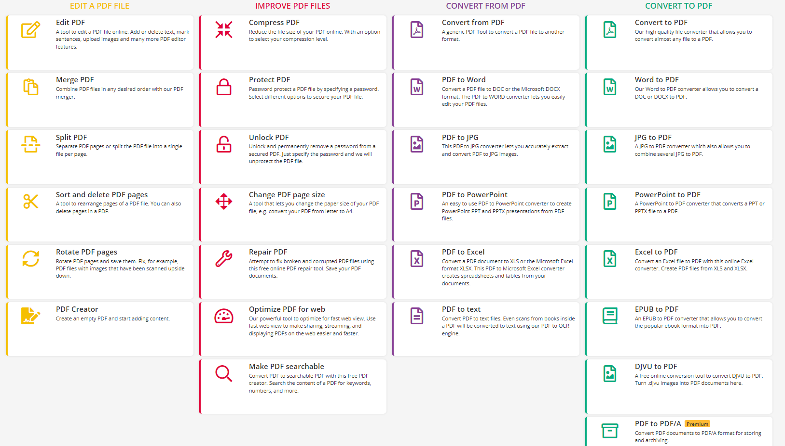

在线工具，无需下载，就是好！
- [[leetcode]]
- [[dida]]网页版
- https://www.pdf2go.com/
  - 可以做的：
  - 可以联合[[download-resource]]使用
  - 免费版有功能限制（比如图片转pdf的图片数量）
    - 哈哈，图片转pdf其实用[[markdown-preview-enhanced]]非常好
- https://tool.lu/
  - 不要用这个的dns查询，因为是被国内污染的，参考[[hosts]]
  - 下面列举实用的
  - https://tool.lu/holiday/
  - https://tool.lu/wordcount/
    - 字数计算，包括中英，标点，空白等等
  - https://tool.lu/diff/
    - 对比和**归并**
  - https://tool.lu/zhconvert/
    - 繁简转换
  - https://tool.lu/qrcode/
  - https://tool.lu/ocr/
    - ocr（可以上传电脑图片或手机微信扫码上传图片。需要登录）
    - 亲测效果在2022.7好于[[tesseract]]
  - https://tool.lu/coderunner/