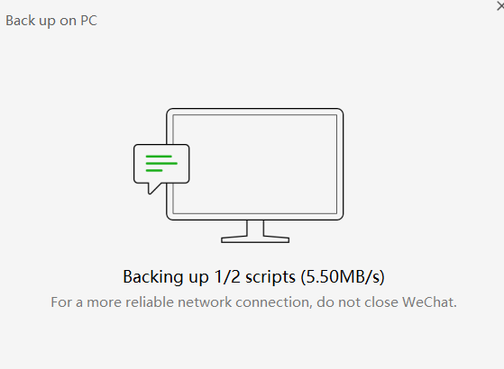

- 删除和清空
  - 手机长按文件传输助手，删除，可以清空记录
    - 如果还需要传输助手，重新搜索就出来了
  - 但是对于群，**如果你没有右上角三个点-添加到通讯录**，那么删除和清空聊天记录是不同的
    - 删除：找不到群了，除非下次有人说话
    - 清空：还能找到群
- 公众号-右上角人像-右上角三个点-Settings
  - 可以加到Home Screen（参考[[permission]]）
  - 可以设置是否提醒
- 搜索聊天历史记录，进上下文后可以长按选择quote引用（回复）
  - 返回到主聊天界面就不能了。所以要在进上下文后回复
  - 可以造成回很久很久之前消息的神奇效果
- 备份聊天记录
  - 需要手机电脑连同一个网（比如电脑连手机热点）
    - 虚拟机：需要物理机连手机热点（或其它网络）
    - 再参考[[network]]设置虚拟机为桥接模式，不能是NAT模式！
  - 手机打开到微信界面
  - 电脑端左下角三横 - Backup* - Back up on PC
  - 手机选择备份哪些聊天记录（这个不用急。电脑端微信可能会以为没连上网，催你，但是不用急！慢慢挑）
  - 开始备份
  - 备份完Manage*选项可以看到文件路径。我们可以拷贝保存
  - 保存这三个即可
  - 之后想要时拷回来到指定路径即可还原