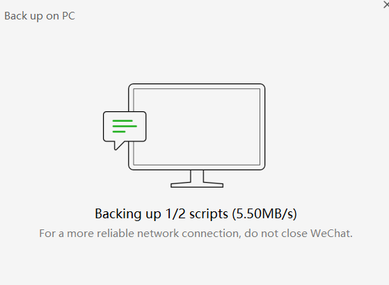
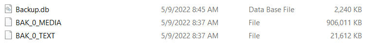
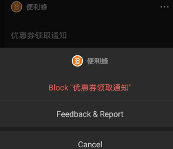

- 前置
  - 安卓：[[optimize]]
- 删除和清空
  - 手机长按文件传输助手，删除，可以清空记录
    - 如果还需要传输助手，重新搜索就出来了
  - 但是对于群，**如果你没有右上角三个点-添加到通讯录**，那么删除和清空聊天记录是不同的
    - 删除：找不到群了，除非下次有人说话
    - 清空：还能找到群
- 加快捷方式到homescreen（安卓专属）
  - 典型的公众号/小程序加到桌面非常方便
    - 近邻宝可以从小程序中一键取件，不输密码
    - 微信记账本可以在微信支付记录基础上增删改查数据（比如把退款去掉等等，方便看收支）
  - 公众号：`公众号图标-右上角人像-右上角三个点-Settings`，看到选项
  - 小程序：`小程序界面右上角三个点`，看到选项
  - 个人：`聊天界面 - 对方头像 - 右上角三个点 - Add to Home Screen`
- 搜索聊天历史记录，进上下文后可以长按选择quote引用（回复）
  - 返回到主聊天界面，刚刚选择的引用就没了
  - 所以要在进上下文后回复
  - 可以造成回很久很久之前消息的神奇效果
- 备份聊天记录
  - 需要手机电脑连同一个网
    - 比如电脑连手机热点
    - 公司学校wifi有时会失败
    - 虚拟机
      - 需要物理机连手机热点（或其它网络），如刚才所说
      - 再参考[[network]]设置虚拟机为桥接模式，不能是NAT模式！
  - 手机打开到微信界面
  - 电脑端左下角三横 - Backup* - Migrate* - Back* - Back up on PC
  - 手机选择备份哪些聊天记录
    - 这个不用急。电脑端微信可能会以为没连上网，催你，但是不用急！慢慢挑
    - 确认后可能会卡住，重试可能解决
  - 开始备份
    - 传输过程不关手机电脑屏幕，不离开微信等，一直保持最佳状态防止被[[optimize]]
  - 备份完Manage*选项可以看到文件路径。我们可以拷贝记住
    - 典型：`C:\Users\<用户名>\Documents\WeChat Files\wxid_<id>\BackupFiles`
  - 保存这三个即可
  - 之后想要时拷回来这些文件到前述路径，电脑端左下角三横 - Backup* - Migrate* - Back* - Restore*即可
    - 当然也就可以跨机器持久保存等
- notifications
  - 微信运动等等东西（“官方图标”）也可以设置mute notifications，防止骚扰
  - `Me-Settings-Message Notifications`
    - 可以设置是否提醒
    - 注意普通信息提醒和语音电话提醒是分开设置的
  - Service Notifications处可以用各个方块右上角的三个点Block掉通知
    - 比如专门block掉便利蜂的优惠券通知
  - Weixin Pay之类玩意也可以点进去齿轮设置不提醒
- stickers
  - 新表情：任意聊天窗口 - 表情图标（笑脸） - 加号图标 - 加号图标 - 选图
  - 新增了表情之后以后即可从“笑脸”图标选择，并发出表情。别人也可以长按添加了
  - 一些人眼中的表情包“鄙视链”：自己做图 > 收藏单图 > 收藏组图 > 直接买的蜜桃猫等组图 > 微信自带表情。当然这只是一种价值观
- 关于屏蔽、拉黑等
  - 屏蔽朋友圈不给别人看/拉黑，效果都是看不到“几天可见”字样，朋友圈没有东西
  - 验证是否拉黑：尝试转账，看能不能来到输密码界面
- 电脑登录
  - 一开始几次需要手机扫码登录。有自动同步最近消息选项
  - 多登录几次，过几天了，就可以选择电脑直接登不使用手机
  - [[toolbox/web]]：时至2023.4一般场景不行，但文件传输助手可以用[网页版](https://szfilehelper.weixin.qq.com/)，则不需下载电脑客户端
- 双开
  - 电脑选中微信图标，连按两次enter，出来的两个窗口可分别登录两个手机
  - [手机参考](https://new.qq.com/rain/a/20191223A01GTW00#:~:text=%E5%A6%82%E6%9E%9C%E6%98%AF%E5%AE%89%E5%8D%93%E6%89%8B%E6%9C%BA%E5%B0%B1,%E7%A4%BE%E4%BA%A4APP%E7%9A%84%E5%8F%8C%E5%BC%80%E5%8A%9F%E8%83%BD%E3%80%82)
- 彩蛋
  - 手机发`想你了`有下降星星
- [[ocr]]
  - 电脑端打开图片，直接鼠标拖动可复制文字
- 发出`#小程序://腾讯文档/<token>`这种东西之后，可以点链接
  - 一般地方（比如浏览器）用不了