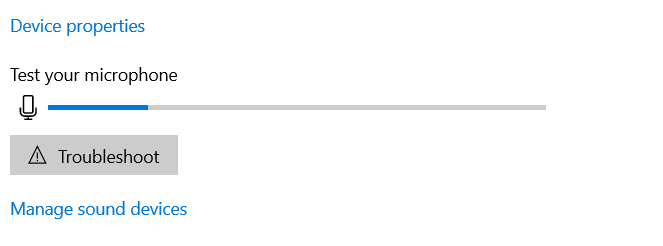

使用[[lovo]]导出`.wav`音频后，电脑拿个媒体播放器后台播放
- 参考[这个回答](https://www.zhihu.com/question/303686666/answer/1118558268)可以录制电脑中播放的声音（即：改变输入设备）
  - 正确的效果：电脑放出声音时，麦克风条动，如图
- office ppt中
  - 插入-右上角找录屏键
  - 选择全屏作为录制范围
  - 后台放声音，前台放映ppt即可
  - 最后`Win+Shift+Q`停止录屏

- 输出视频后可以用各种视频编辑器进行编辑。比如win10自带的编辑器：如果不小心卸了就用[[app]]里的方法装回来