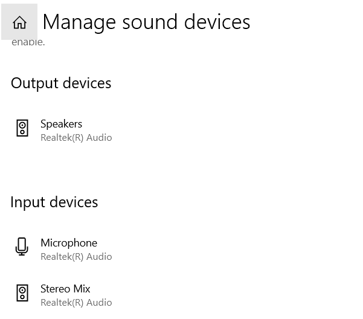

- 参考[这个回答](https://www.zhihu.com/question/303686666/answer/1118558268)
- 开始菜单Manage sound devices，改变输入设备。如图
- 验证效果：开始菜单Sound settings
  - 对于Stereo Mix，电脑放出声音时，麦克风条动，如图
    - 有可能插耳机不行，必须外放才有反应
  - 对于Microphone，人说话时麦克风条动
- 如果需要内外声音都录上，参考[[listen]]