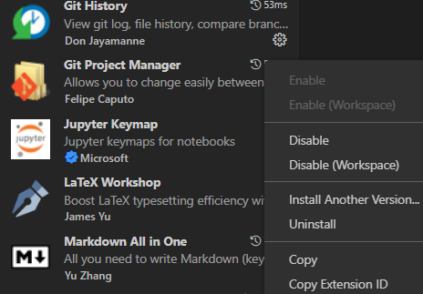

- 安装
```sh
curl https://packages.microsoft.com/keys/microsoft.asc | gpg --dearmor > microsoft.gpg
sudo mv microsoft.gpg /etc/apt/trusted.gpg.d/microsoft.gpg
sudo sh -c 'echo "deb [arch=amd64] https://packages.microsoft.com/repos/vscode stable main" > /etc/apt/sources.list.d/vscode.list'
sudo apt update
sudo apt install code
```
- 安装[[extensions/general]]：`code --install-extension <插件ID>`
  - `ID`查看方法：如图右键齿轮
- 举例：对于一台用于连接远程，做笔记上课（需要显示`.pdf`，写`.md, .tex`，需要foam等）的便携办公终端（不写本地`.py`等代码）
```sh
code --install-extension foam.foam-vscode
code --install-extension yzhang.markdown-all-in-one
code --install-extension shd101wyy.markdown-preview-enhanced
code --install-extension mushan.vscode-paste-image
code --install-extension ms-vscode-remote.remote-ssh
code --install-extension donjayamanne.githistory
code --install-extension felipecaputo.git-project-manager
code --install-extension James-Yu.latex-workshop
code --install-extension tomoki1207.pdf
```
- 举例：要运行`.py`代码的
```sh
code --install-extension yzhang.markdown-all-in-one
code --install-extension shd101wyy.markdown-preview-enhanced
code --install-extension donjayamanne.githistory
code --install-extension felipecaputo.git-project-manager
code --install-extension ms-python.python
```
- 列出[[extensions/general]]：`code --list-extensions`
- 查看版本：`code --version`
- `root`身份启动：`code --no-sandbox --user-data-dir <文件夹>`