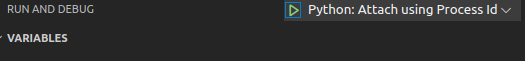

前置：
- 参考[[4-more-commands]]了解进程、进程号的基本知识。
- vscode中的python调试，例如[[launch]]
- [[yama-ptrace-scope]]

# 对python进程的attach
在`launch.json`中加入
```json
        {
            "name": "Python: Attach using Process Id",
            "type": "python",
            "request": "attach",
            "processId": "${command:pickProcess}",
        }
```
（如果你**把104-public-knowledge-base作为工作目录**打开，那么你应该已经可以使用这个库里现成的了，如图）

- 直接`python`本目录下的`sample.py`，然后
  - 新开个终端`ps -ef | grep ...`到进程号（参见[[11-basic-scripting-partB]]）
  - 或者把输入命令从`python <文件名>`改为`python <文件名> &`，直接输出进程号，然后让他后台运行
- 现在保持`sample.py`运行，同时`F5`运行debugger，连接到指定进程。此时可以打断点等

如果连接失败，参考[github issue](https://github.com/microsoft/debugpy/issues/102)