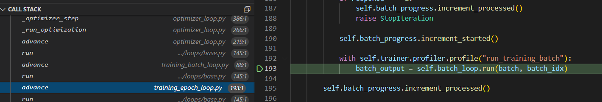

- 前置
  - [[breakpoint]]
- 经常可以在合适地方打[[breakpoint]]，然后在左侧`CALL STACK`选项卡查看运行栈，逐层从内到外查看
  - 绿色的行表示“正在进入这一行”
  - 
- 左边点选适合的栈帧，然后下方[[debug-console]]中也可以取出该帧中的（局部）变量，左侧也可以查看
- `"justMyCode": true`跳过库函数，相应栈的长度也短很多，比较清爽（参考[[launch]]）
- 举例应用
  - 对于深度学习框架，如[[model]]、[[lightning/basics]]等，你的模型、数据集等往往会被包住很多层
    - 此时在自己的模型中打断点，栈帧往往就很深，可以帮助理解深度学习框架的结构
  - 如果你很熟悉框架，反而是要看具体的“新增东西”（比如这篇论文创新点在哪），当然就可以`"justMyCode": true`，跳过库函数
- 在[[minimum]]调试中，也可以使用call stack，对某个进程运行到某处停下