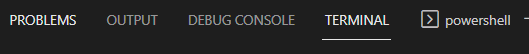

下方这里

debug console这里可以往里面即时输入命令查看变量，做运算查看变量运算结果，或者保存中间对象`.pkl`，张量保存成图片等等。可以交互式，非常方便
# 应用
- 可以结合[[call-stack]]看各个层的运行环境的变量有哪些，是什么
- 并不是没[[breakpoint]]就用不了哈！你程序报错的那个地方也是个“断”，也可以用debug console，也可以用[[call-stack]]！
- 打[[breakpoint]]，中途用`.shape`验证炼丹过程中张量是否正常
- 打[[breakpoint]]，把（之后可能变的）变量保存成临时变量，然后按`F5`让程序运行到其它地方再停下，然后用上刚刚的临时变量
- `dump`出中间东西到`.pkl`（参考[[pickle/basics]]）
- 直接写文件看（注意要确认`str`方法有合法的字符串输出。注意换行`\n`）
```python
with open("a.txt", 'w') as f:
    for item in self.history:
        s = str(item['state'])
        f.write(s+'\n')
```

# 快捷键
- `tab`补全（不是回车补全）
- 需要多行：`Shift + Enter`（不是直接回车）
- 上下键看历史。可以一次一整条多行的语句。而不是原始的`python`交互式中一次一行
- 复制历史信息：右键复制，不能`Ctrl+C`也不能`Ctrl+Shift+C`