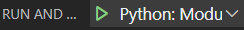

## `launch.json`
`launch.json`可以指定运行时的各种配置。比如[[vscode-python]]中提到的
## 新建配置
- 比如想要用`launch.json`中的一套配置去表示一个`python -m 某某`命令以方便复用。假设目前还没有`launch.json`文件，第一次创建
  - `python -m`含义参考[[module-launch]]
  - `Ctrl + Shift + D` - 左侧create a launch.json file - 上方选择Module - 选择源码文件路径
  - 进去`launch.json`之后，可以看到`"name"`字段，可以自定义名称，就能显示在左上角绿色播放键旁边
- 已有`launch.json`时
  - 编辑器打开`launch.json`，旁边有蓝色`Add Configuration...`按钮
  - 点击后，也可以上方选择相应模板，快速添加configuration
## 解释器
比如`conda activate <名字>`，`which python`找到python解释器路径
然后`Ctrl + Shift + P`，打`interpreter`，就找到选解释器的命令了。对照着刚刚`which python`的输出选解释器即可
- 注：刚刚说`launch.json`中的`"python"`字段会覆盖这里的设置。当两者不同时，可能造成pylance无法解析你的`import`
- 所以不推荐两者不同