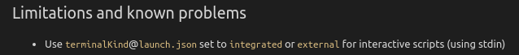

https://zbttl-github-io.vercel.app/vscode-diao-shi-bash-shell-jiao-ben/
https://marketplace.visualstudio.com/items?itemName=rogalmic.bash-debug
- ，也就是设置成[[debug-console]]可不行！
- 其他小issue：比如强制第一行断点等
- 熟悉其[[debug-console]]行为：`echo 1`输出0，<code>&#96;echo 1&#96;</code>才输出1