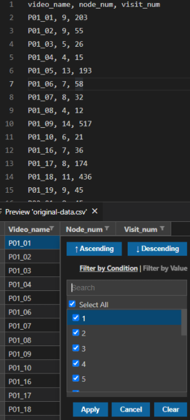

- 可以预览csv, xlsx等[[file-format]]
- 对于`.csv`格式
  - 快捷键`Ctrl+Shift+V`. 或`Ctrl+Shift+P`打开command palette搜索`CSV`可看到preview命令
  - 可以预览，并做简单操作如排序，过滤
    - 
  - 接受什么分隔符可以去[[vscode/settings]]调整
    - 参考插件官方文档，注意转义
    - 直接`json`编辑需要两个`\`即`\\t`
    - gui编辑需要一个`\`即`\t`